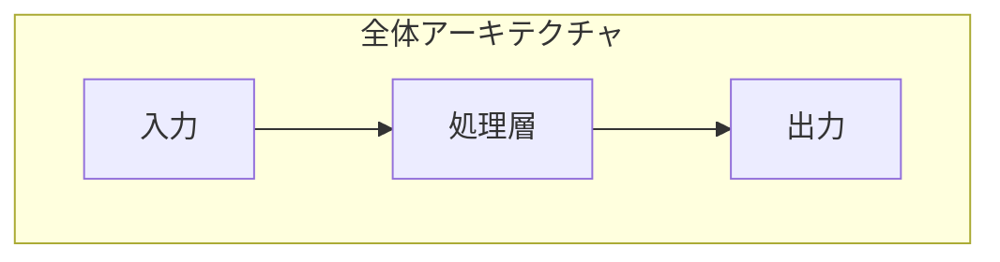
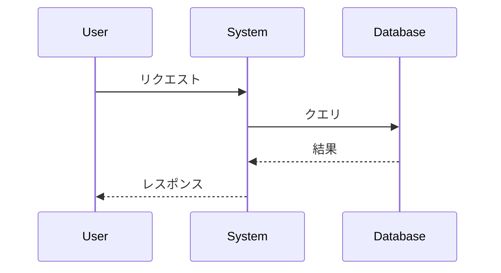

# 【{概念名}】{タイトル} - {得られること}がわかる

## はじめに

- **対象読者**: {ターゲット読者の説明}
- **この記事で得られること**: {この記事を読んで得られる知識・スキル}
- **前提知識**: {user_skill_profile.yaml から自動判定。advanced/expert のスキルは既知として扱う}

---

## 目次

1. [3行まとめ](#1-3行まとめ)
2. [なぜこれが必要なのか](#2-なぜこれが必要なのか)
3. [仕組みを図解で理解](#3-仕組みを図解で理解)
4. [具体例で確認](#4-具体例で確認)
5. [よくある誤解](#5-よくある誤解)
6. [次に学ぶべきこと](#6-次に学ぶべきこと)

---

## 1. 3行まとめ

> **TL;DR（忙しい人向け）**

- 📌 {ポイント1: 最も重要な概念}
- 📌 {ポイント2: なぜ必要か}
- 📌 {ポイント3: どう使うか}

---

## 2. なぜこれが必要なのか

### 背景・課題

{この技術・概念が生まれた背景と、解決しようとしている課題を説明}

### 従来のアプローチとその限界

{従来の方法と、その問題点を説明}

### 解決策としての {概念名}

{この概念がどのように課題を解決するかを説明}

---

## 3. 仕組みを図解で理解

### 全体像



{図の解説: 各要素が何を表し、どう連携しているか}

### 詳細フロー



{シーケンスの解説: 時系列で何が起きているか}

### 比喩で理解

> 🏠 **日常の例えで説明すると...**
>
> {複雑な概念を身近な例えで説明}

---

## 4. 具体例で確認

### 基本的な使い方

```{言語}
// コード例
{基本的なコード例}
```

**ポイント解説:**
- {コードの重要ポイント1}
- {コードの重要ポイント2}

### 実践的なユースケース

```{言語}
// より実践的なコード例
{実務に近いコード例}
```

---

## 5. よくある誤解

### ❌ 誤解1: {よくある間違い}

> ✅ **正解**: {正しい理解}

### ❌ 誤解2: {よくある間違い}

> ✅ **正解**: {正しい理解}

### 💡 ハマりポイント

{初心者がつまずきやすいポイントと回避方法}

---

## 6. 次に学ぶべきこと

この概念を理解したら、次は以下のトピックに進みましょう：

| トピック | 関連性 | 優先度 |
|---------|--------|--------|
| {関連概念1} | {なぜ関連するか} | ⭐⭐⭐ |
| {関連概念2} | {なぜ関連するか} | ⭐⭐ |
| {関連概念3} | {なぜ関連するか} | ⭐ |

---

## 参考資料

- [公式ドキュメント]({URL})
- [関連記事]({URL})

---

*Generated by Tech-Educator | Skill Level: {user_skill_level}*
