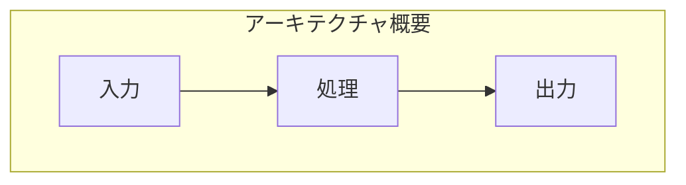
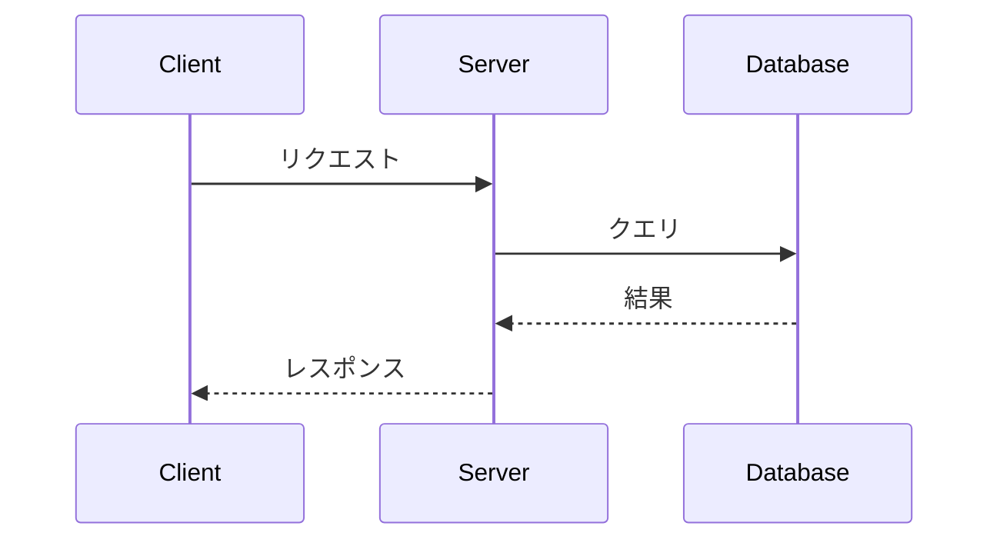

# {タイトル}（技術解説ドキュメント）

## 概要

本ドキュメントでは、**{主題}**について、実際の使用例を交えながら詳しく解説します。

{背景・文脈の説明 - PRPからの繋がりを含める}

### このガイドで得られること

- {得られる知識・スキル1}
- {得られる知識・スキル2}
- {得られる知識・スキル3}

### 対象読者

- {対象読者1}
- {対象読者2}

### 前提知識

{user_skill_profile.yaml から自動判定。advanced のスキルは「〇〇は知っている前提」として列挙}

---

## 目次

1. [{セクション1タイトル}](#1-セクション1タイトル)
2. [{セクション2タイトル}](#2-セクション2タイトル)
3. [{セクション3タイトル}](#3-セクション3タイトル)
4. [{セクション4タイトル}](#4-セクション4タイトル)
5. [実装Tips・落とし穴](#5-実装tips落とし穴)
6. [まとめとおすすめの使い方](#6-まとめとおすすめの使い方)

---

## 1. {セクション1タイトル}

### 全体像



{図の解説}

### 主要コンポーネント

| コンポーネント | 役割 | 備考 |
|---------------|------|------|
| {コンポーネント1} | {役割} | {補足} |
| {コンポーネント2} | {役割} | {補足} |

---

## 2. {セクション2タイトル}

### 設定手順

1. **{ステップ1}**: {説明}
2. **{ステップ2}**: {説明}
3. **{ステップ3}**: {説明}

### コード例（コピペ可能）

```javascript
// {コード説明}
{完成形のコード - そのまま使える形式}
```

**ポイント**:
- {重要ポイント1}
- {重要ポイント2}

---

## 3. {セクション3タイトル}

### 処理フロー



{シーケンスの解説}

### 使用例

| シナリオ | 実装方法 |
|---------|---------|
| {ユースケース1} | {方法} |
| {ユースケース2} | {方法} |

---

## 4. {セクション4タイトル}

{内容に応じたセクション}

---

## 5. 実装Tips・落とし穴

### 注意点

| 項目 | 内容 |
|------|------|
| ⚠️ {注意点1} | {詳細} |
| ⚠️ {注意点2} | {詳細} |

### デバッグ観点

- **{確認ポイント1}**: {どう確認するか}
- **{確認ポイント2}**: {どう確認するか}

### 検証チェックリスト

- [ ] {検証項目1}
- [ ] {検証項目2}
- [ ] {検証項目3}

---

## 6. まとめとおすすめの使い方

### 本ドキュメントで学んだこと

| トピック | 内容 |
|---------|------|
| {トピック1} | {概要} |
| {トピック2} | {概要} |

### おすすめの活用方法

| シナリオ | 活用方法 |
|---------|---------|
| {シナリオ1} | {方法} |
| {シナリオ2} | {方法} |

### 次に学ぶべきこと

- [{関連トピック1}]({リンク}) - {なぜ関連するか}
- [{関連トピック2}]({リンク}) - {なぜ関連するか}

---

## 補足リンク

- [{公式ドキュメント}]({URL})
- [{参考記事}]({URL})

---

*Generated by Tech-Educator | Skill Level: {user_skill_level} | PRPからの関連: {PRP項目}*
