# spec/sample_implementation_plan.md
# Architect-Plan出力サンプル

**Project:** Todo App MVP
**Date:** 2026-01-24
**Architect:** Architect-Plan (Claude Opus)

---

## 1. アーキテクチャ概要

```
┌─────────────────┐     ┌─────────────────┐     ┌─────────────────┐
│   Frontend      │────▶│    Backend      │────▶│    Database     │
│   (React)       │     │   (Node.js)     │     │   (SQLite)      │
└─────────────────┘     └─────────────────┘     └─────────────────┘
```

## 2. 並列トラック分割

### Track A: Frontend (Senior-Coder-1)
| # | タスク | 依存 | 見積 |
|---|--------|------|------|
| A1 | プロジェクト初期化 (Vite + React) | なし | 10min |
| A2 | TodoList.tsx 実装 | A1 | 20min |
| A3 | TodoItem.tsx 実装 | A1 | 20min |
| A4 | TodoForm.tsx 実装 | A1 | 15min |
| A5 | API連携フック作成 | A2,A3,A4 | 30min |

### Track B: Backend (Senior-Coder-2)
| # | タスク | 依存 | 見積 |
|---|--------|------|------|
| B1 | Express サーバー初期化 | なし | 10min |
| B2 | SQLite スキーマ定義 | B1 | 15min |
| B3 | GET /api/todos 実装 | B2 | 15min |
| B4 | POST /api/todos 実装 | B2 | 15min |
| B5 | DELETE /api/todos/:id 実装 | B2 | 10min |

## 3. 依存関係グラフ

```mermaid
gantt
    title 並列実行タイムライン
    dateFormat  HH:mm
    section Track A
    A1 プロジェクト初期化    :a1, 00:00, 10m
    A2 TodoList              :a2, after a1, 20m
    A3 TodoItem              :a3, after a1, 20m
    A4 TodoForm              :a4, after a1, 15m
    A5 API連携               :a5, after a2 a3 a4, 30m
    section Track B
    B1 サーバー初期化        :b1, 00:00, 10m
    B2 スキーマ定義          :b2, after b1, 15m
    B3 GET実装               :b3, after b2, 15m
    B4 POST実装              :b4, after b2, 15m
    B5 DELETE実装            :b5, after b2, 10m
```



## 4. 統合ポイント

**A5完了 + B5完了 → 統合テスト開始**

---

*Generated by Architect-Plan*
