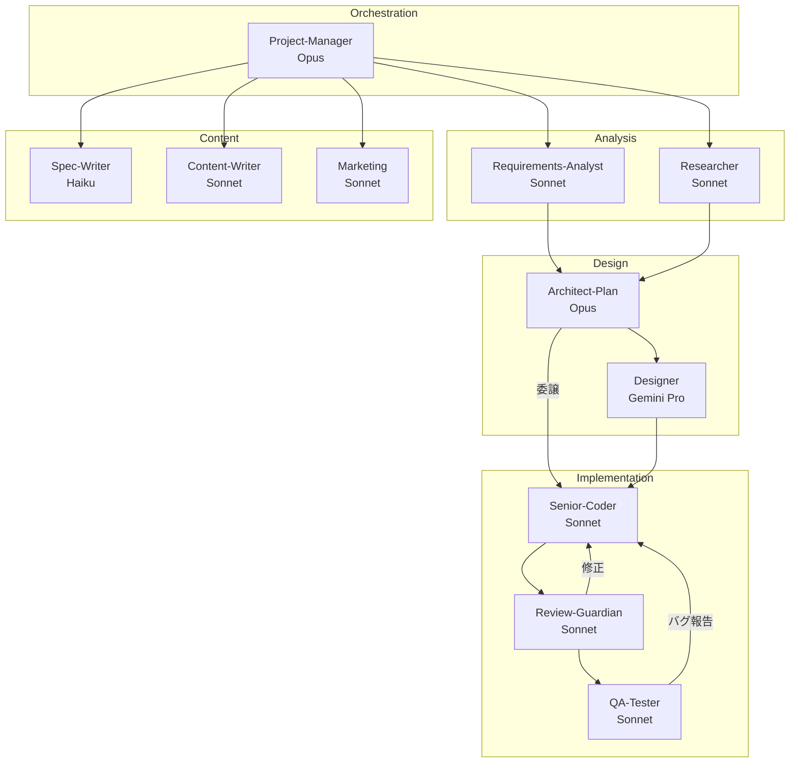

# Antigravity Life OS - Guild Reference

エージェント・ギルド構成とシステム構造のリファレンス。

---

## 1. Agent Team (12 Agents)



### 委譲構造

| From | To | 説明 |
|------|----|----|
| PM | Architect-Plan | 設計・タスク分割を依頼（Coderに直接指示しない） |
| Architect-Plan | Senior-Coder | 実装プランに基づく具体的なタスク指示 |
| Designer | Architect-Plan | モックアップ完成報告 |
| Researcher | Architect-Plan | 調査結果報告 |

### Agent Definitions

| Agent | Model | Role | Output | 指示元 |
|:------|:------|:-----|:-------|:------|
| **Project-Manager** | Opus | 統括 | `docs/project_status.md` | user |
| **Requirements-Analyst** | Sonnet | 要件分析 | `docs/requirements.md` | PM |
| **Researcher** | Sonnet | 調査 | `research/` | PM |
| **Architect-Plan** | Opus | 技術設計 | `spec/implementation_plan.md` | PM |
| **Designer** | Gemini Pro | UIデザイン | `resources/mockups/` | PM |
| **Senior-Coder** | Sonnet | 実装 | `src/` | **Architect-Plan** |
| **Review-Guardian** | Sonnet | レビュー | `review_report.md` | PM |
| **QA-Tester** | Sonnet | ブラウザテスト | `tests/e2e/` | PM |
| **Spec-Writer** | Haiku | 技術ドキュメント | `docs/api/` | PM |
| **Content-Writer** | Sonnet | コンテンツ | `src/content/` | PM |
| **Marketing** | Sonnet | SEO/マーケ | `docs/marketing_strategy.md` | PM |

**注**: Senior-Coderは**Architect-Plan**から直接タスク指示を受けます（PMから直接指示しない）

---

## 2. Workflow (9 Phases)

```
Phase 0: Requirements   → Requirements-Analyst
Phase 1: Research       → Researcher（調査・競合分析）
Phase 2: Design         → Designer（UIモックアップ）
Phase 3: Planning       → Architect-Plan（技術設計・タスク分割）
Phase 4: Implementation → Senior-Coder（並列・Architect経由で指示）
Phase 5: Review         → Review-Guardian
Phase 6: QA Testing     → QA-Tester（ブラウザテスト・E2E）
Phase 7: Marketing      → Marketing
Phase 8: Integration    → PM
```

---

## 3. Project Structure

```
projects/[project]/
├── CLAUDE.md           # Claude Code設定
├── docs/
│   ├── PRP.md          # 初期要件
│   ├── requirements.md # 詳細要件
│   └── marketing_strategy.md
├── spec/               # 実装プラン
├── research/           # 調査結果
├── resources/mockups/  # デザイン
├── src/                # ソースコード
└── tests/
```

---

## 4. Quick Start

```bash
# プロジェクト作成
./projects/scripts/init-project.sh my-app

# 並列エージェント起動
./projects/scripts/launch-agents.sh my-app --agents parallel-coders

# 全エージェント起動
./projects/scripts/launch-agents.sh my-app --agents full-team
```

### プロンプト生成（推奨）

`agents.json` から動的にサブエージェント用プロンプトを生成：

```bash
# 特定エージェントのプロンプト表示
./projects/scripts/subagent-prompt-generator.sh architect-plan

# 利用可能なエージェント一覧
./projects/scripts/subagent-prompt-generator.sh list
```

PMに「PRPを分析して」と依頼すると、ワークフローを自動進行。

---

## 5. Related Docs

- [PM_ORCHESTRATION.md](./PM_ORCHESTRATION.md) - PM操作ガイド
- [DESIGN_WORKFLOW.md](./DESIGN_WORKFLOW.md) - デザインワークフロー
- [WORKFLOW_EXAMPLES.md](./WORKFLOW_EXAMPLES.md) - プロンプト例

---
*Last Updated: 2026-01-24*
