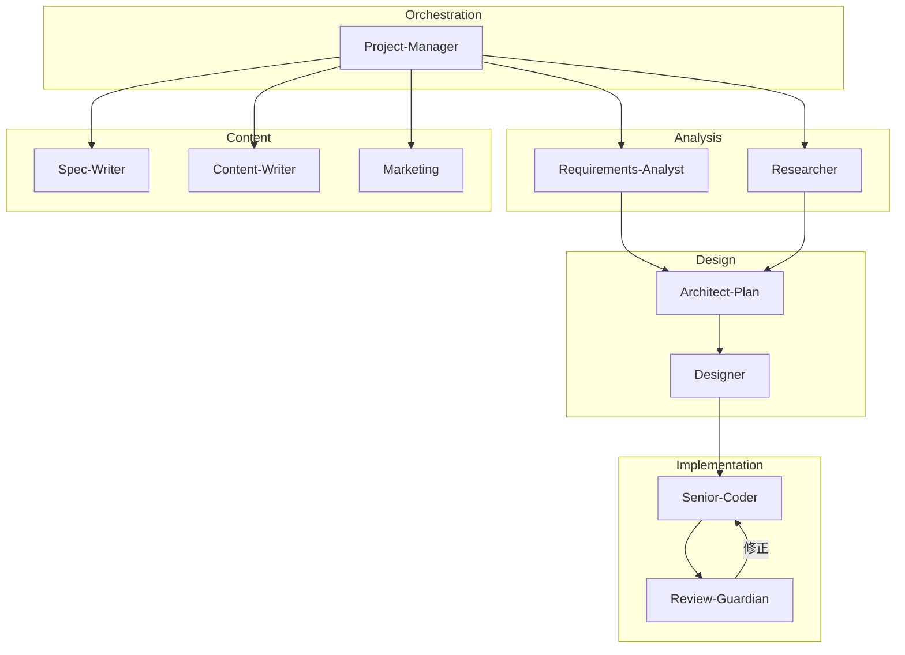

# Antigravity Life OS - Guild Reference

エージェント・ギルド構成とシステム構造のリファレンス。

---

## 1. Agent Team (11 Agents)



### Agent Definitions

| Agent | Model | Role | Output |
|:------|:------|:-----|:-------|
| **Project-Manager** | Opus | 統括 | `docs/project_status.md` |
| **Requirements-Analyst** | Sonnet | 要件分析 | `docs/requirements.md` |
| **Researcher** | Sonnet | 調査 | `research/` |
| **Architect-Plan** | Opus | 技術設計 | `spec/implementation_plan.md` |
| **Designer** | Gemini Pro | UIデザイン | `resources/mockups/` |
| **Senior-Coder** | Sonnet | 実装 | `src/` |
| **Review-Guardian** | Sonnet | レビュー | `review_report.md` |
| **Spec-Writer** | Haiku | 技術ドキュメント | `docs/api/` |
| **Content-Writer** | Sonnet | コンテンツ | `src/content/` |
| **Marketing** | Sonnet | SEO/マーケ | `docs/marketing_strategy.md` |

---

## 2. Workflow (7 Phases)

```
Phase 0: Research      → Researcher
Phase 1: Requirements  → Requirements-Analyst
Phase 2: Planning      → Architect-Plan
Phase 3: Design        → Designer (Nano Banana)
Phase 4: Implementation→ Senior-Coder (並列)
Phase 5: Review        → Review-Guardian
Phase 6: Marketing     → Marketing
Phase 7: Integration   → PM
```

---

## 3. Project Structure

```
projects/[project]/
├── CLAUDE.md           # Claude Code設定
├── docs/
│   ├── PRP.md          # 初期要件
│   ├── requirements.md # 詳細要件
│   └── marketing_strategy.md
├── spec/               # 実装プラン
├── research/           # 調査結果
├── resources/mockups/  # デザイン
├── src/                # ソースコード
└── tests/
```

---

## 4. Quick Start

```bash
# プロジェクト作成
./projects/scripts/init-project.sh my-app

# 並列エージェント起動
./projects/scripts/launch-agents.sh my-app --agents parallel-coders

# 全エージェント起動
./projects/scripts/launch-agents.sh my-app --agents full-team
```

PMに「PRPを分析して」と依頼すると、ワークフローを自動進行。

---

## 5. Related Docs

- [PM_ORCHESTRATION.md](./PM_ORCHESTRATION.md) - PM操作ガイド
- [DESIGN_WORKFLOW.md](./DESIGN_WORKFLOW.md) - デザインワークフロー
- [WORKFLOW_EXAMPLES.md](./WORKFLOW_EXAMPLES.md) - プロンプト例

---
*Last Updated: 2026-01-24*
