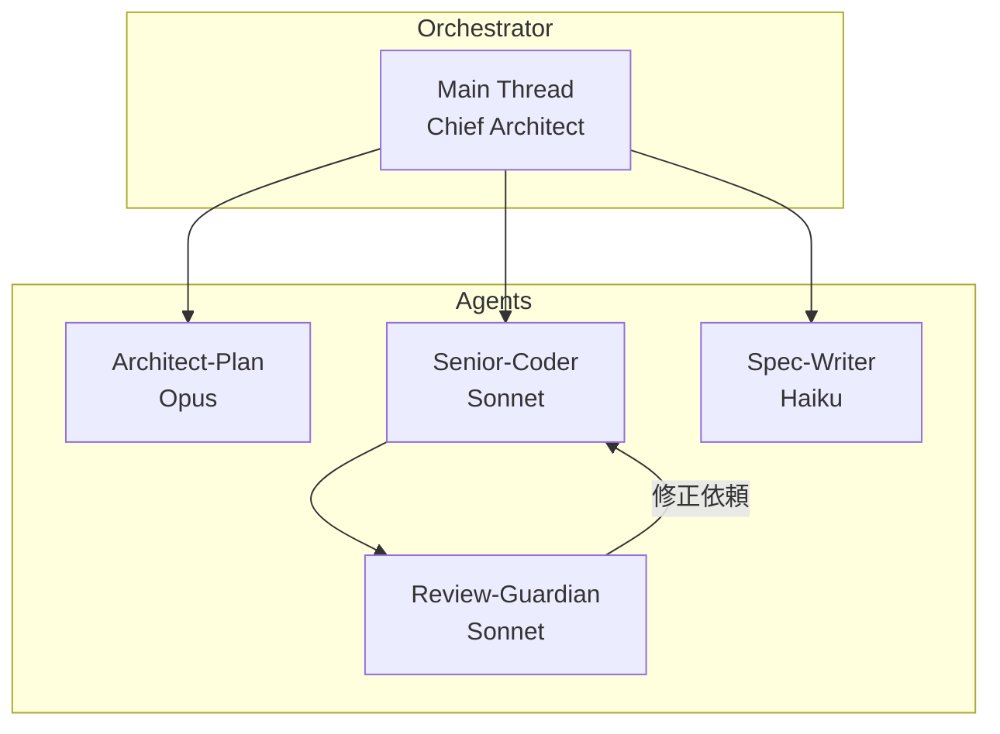
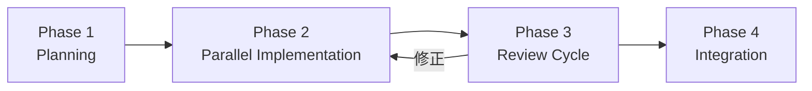

# Antigravity Life OS - Guild Reference

このドキュメントは、Antigravity Life OSのエージェント・ギルド構成とシステム構造をリファレンスとしてまとめたものです。

---

## 1. System Overview

```
/workspace_root/
├── config/                  # システム設定
│   ├── agents.json          # エージェント定義
│   └── common_settings.env  # 環境変数
├── library/                 # ナレッジベース
│   ├── dev-templates/       # 開発用テンプレート
│   ├── creative-templates/  # 制作用テンプレート
│   ├── life-templates/      # 生活用テンプレート
│   └── docs/                # リファレンスドキュメント
├── spec/                    # 実装プラン・詳細仕様
├── research/                # リサーチ資料
├── inbox/                   # マルチモーダル・インボックス
└── projects/                # アクティブなプロジェクト作業場
```

---

## 2. Agent Team

### Architecture Diagram



### Agent Definitions

| Agent | Model | Role | Mission |
|:------|:------|:-----|:--------|
| **Architect-Plan** | Claude Opus | Planning | 構造設計、依存関係分析、フェーズ分割 |
| **Senior-Coder** | Claude Sonnet | Implementation | クリーンコード、テスト作成、パフォーマンス |
| **Review-Guardian** | Claude Sonnet | Quality | セキュリティ、バグ検出、厳格レビュー |
| **Spec-Writer** | Claude Haiku | Documentation | 変更履歴、APIドキュメント |

---

## 3. Workflow Strategy

### 4-Phase Parallel Execution



| Phase | Description | Agent |
|:------|:------------|:------|
| **1. Planning** | コードベース分析、実装プラン作成、トラック分割 | Architect-Plan |
| **2. Implementation** | バックグラウンドで並列実装 | Senior-Coder (×N) |
| **3. Review Cycle** | コードレビュー、修正ループ | Review-Guardian ↔ Senior-Coder |
| **4. Integration** | 最終確認、ビルドチェック | Main Thread |

---

## 4. Constraints

1. **コンテキスト節約**: 1,000行超の調査はサブエージェントに委譲、メインには要約のみ
2. **並列性の活用**: 独立タスクは3つ以上同時実行
3. **自律性**: 各エージェントは自己判断でツールを使い解決まで遂行

---

## 5. Templates Reference

### Dev Templates
- [PRP_TEMPLATE.md](file:///Users/carpediem/workspace/AntiGravity/project-template-dev/library/dev-templates/PRP_TEMPLATE.md) - プロジェクト要件定義
- [CODE_REVIEW_CHECKLIST.md](file:///Users/carpediem/workspace/AntiGravity/project-template-dev/library/dev-templates/CODE_REVIEW_CHECKLIST.md) - レビューチェックリスト

### Creative Templates
- [CONTENT_TEMPLATE.md](file:///Users/carpediem/workspace/AntiGravity/project-template-dev/library/creative-templates/CONTENT_TEMPLATE.md) - コンテンツ制作

### Life Templates
- [WEEKLY_PLANNER.md](file:///Users/carpediem/workspace/AntiGravity/project-template-dev/library/life-templates/WEEKLY_PLANNER.md) - 週間計画

---

## 6. Quick Start

1. **新規プロジェクト開始**: `scripts/init-project.sh <project-name>`
2. **PRPを作成**: `library/dev-templates/PRP_TEMPLATE.md` をコピー
3. **Architect-Plan に設計依頼**: PRPを元に実装プランを `spec/` に作成
4. **並列実装開始**: Senior-Coder をバックグラウンドで起動

---

*Last Updated: 2026-01-24*
