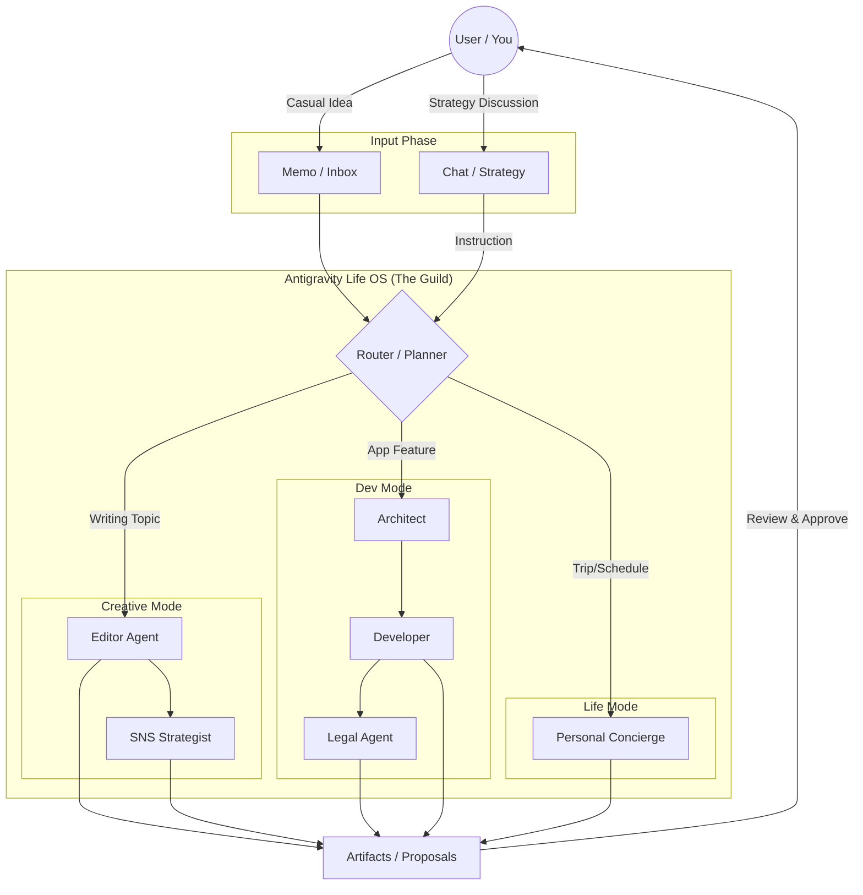

# User Interaction Flow (Antigravity Life OS)

```mermaid
graph TD
    User((User / You))
    
    subgraph "Input Phase"
        Memo[Memo / Inbox]
        Chat[Chat / Strategy]
    end
    
    subgraph "Antigravity Life OS (The Guild)"
        Router{Router / Planner}
        
        subgraph "Creative Mode"
            Editor[Editor Agent]
            SNS[SNS Strategist]
        end
        
        subgraph "Dev Mode"
            Arch[Architect]
            Dev[Developer]
            Legal[Legal Agent]
        end
        
        subgraph "Life Mode"
            Concierge[Personal Concierge]
        end
    end
    
    Output[Artifacts / Proposals]

    %% Flows
    User -->|Casual Idea| Memo
    User -->|Strategy Discussion| Chat
    
    Memo --> Router
    Chat -->|Instruction| Router
    
    Router -->|Writing Topic| Editor
    Editor --> SNS
    
    Router -->|App Feature| Arch
    Arch --> Dev
    Dev --> Legal
    
    Router -->|Trip/Schedule| Concierge
    
    Editor --> Output
    SNS --> Output
    Legal --> Output
    Dev --> Output
    Concierge --> Output
    
    Output -->|Review & Approve| User
```
