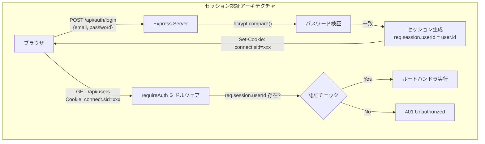

# Express + セッション認証の仕組み（技術解説ドキュメント）

## 概要

本ドキュメントでは、**Express.js におけるセッションベース認証**について、User Management Dev Template の実装コードを引用しながら解説する。

PRPでは「ユーザー登録・ログイン・ログアウト」「セッション管理」が主要スコープとして定義されている。本テンプレートでは `express-session` + `bcrypt` + Cookie を組み合わせたセッション認証を採用しており、この仕組みを理解することがプロジェクト全体の理解に直結する。

### このガイドで得られること

- express-session がリクエストをまたいでユーザーを識別する仕組み
- bcrypt によるパスワードハッシュ化の原理と実装
- Cookie の属性（httpOnly, sameSite, secure）がセキュリティに与える影響
- 本テンプレートの認証フロー全体像

### 対象読者

- Express を使った Web アプリ開発の基礎を学びたい人
- セッション認証の仕組みを体系的に理解したい人

### 前提知識

- JavaScript の基礎（async/await 含む）は知っている前提
- HTTP リクエスト/レスポンスの基本概念は理解している前提
- RESTful API の設計パターンは知っている前提

---

## 目次

1. [結論: セッション認証の全体像](#1-結論-セッション認証の全体像)
2. [express-session の仕組み](#2-express-session-の仕組み)
3. [bcrypt によるパスワードハッシュ化](#3-bcrypt-によるパスワードハッシュ化)
4. [認証フローの実装詳細](#4-認証フローの実装詳細)
5. [実装Tips・落とし穴](#5-実装tips落とし穴)
6. [まとめとおすすめの使い方](#6-まとめとおすすめの使い方)

---

## 1. 結論: セッション認証の全体像

セッション認証とは、サーバー側にユーザーの状態（セッション）を保持し、Cookie に格納されたセッション ID で紐付ける認証方式である。JWT のようにトークン自体に情報を持たせる方式と異なり、状態はサーバーに存在する。

本テンプレートでは以下の構成で認証を実現している:



### 主要コンポーネント

| コンポーネント | ファイル | 役割 |
|---------------|---------|------|
| express-session | `src/config/session.js` | セッションの生成・管理・Cookie 設定 |
| bcrypt | `src/routes/auth.js` | パスワードのハッシュ化と検証 |
| requireAuth | `src/middleware/auth.js` | 認証チェックミドルウェア |
| User モデル | `src/models/user.js` | DB からのユーザー検索・作成 |

---

## 2. express-session の仕組み

### なぜ express-session を使うのか

HTTP はステートレスなプロトコルであり、リクエスト間で状態を持たない。「ログイン済みかどうか」を判別するために、サーバー側にセッションデータを保持し、Cookie 経由でクライアントと紐付ける仕組みが必要になる。

### セッションのライフサイクル

```mermaid
sequenceDiagram
    participant Browser as ブラウザ
    participant Express as Express Server
    participant Store as セッションストア(メモリ)

    Browser->>Express: POST /api/auth/login
    Express->>Express: パスワード検証 OK
    Express->>Store: セッション作成 {userId: 1}
    Store-->>Express: セッションID: abc123
    Express-->>Browser: Set-Cookie: connect.sid=s%3Aabc123.signature

    Browser->>Express: GET /dashboard (Cookie: connect.sid=s%3Aabc123.signature)
    Express->>Store: セッションID abc123 のデータ取得
    Store-->>Express: {userId: 1}
    Express->>Express: req.session.userId = 1 (認証OK)
    Express-->>Browser: 200 OK + ダッシュボードHTML

    Browser->>Express: POST /api/auth/logout
    Express->>Store: セッション abc123 を削除
    Express-->>Browser: Set-Cookie: connect.sid=; Max-Age=0
```

### コード例（コピペ可能）

本テンプレートのセッション設定 (`src/config/session.js`):

```javascript
const session = require('express-session');

module.exports = session({
  secret: process.env.SESSION_SECRET || 'dev-secret',
  resave: false,
  saveUninitialized: false,
  cookie: {
    httpOnly: true,
    secure: false,
    sameSite: 'lax',
    maxAge: 24 * 60 * 60 * 1000
  }
});
```

**各オプションの意味**:

| オプション | 値 | 意味 |
|-----------|---|------|
| `secret` | 環境変数から取得 | Cookie の署名に使う秘密鍵。漏洩するとセッション偽造が可能になる |
| `resave` | `false` | セッションに変更がなければストアに再保存しない（パフォーマンス最適化） |
| `saveUninitialized` | `false` | 空のセッションはストアに保存しない（GDPR 対応にも有効） |
| `httpOnly` | `true` | JavaScript から Cookie にアクセス不可（XSS 対策） |
| `secure` | `false` | HTTP でも送信（開発用。本番では `true` にして HTTPS 必須にする） |
| `sameSite` | `'lax'` | 別サイトからの POST リクエストに Cookie を付与しない（CSRF 軽減） |
| `maxAge` | 24時間 | Cookie の有効期限 |

`app.js` でミドルウェアとして登録:

```javascript
const sessionMiddleware = require('./config/session');
app.use(sessionMiddleware);
```

**ポイント**:
- `app.use(sessionMiddleware)` の位置はルーティングより前に置く必要がある
- `secret` は本番環境では必ず十分に長いランダム文字列を設定する

---

## 3. bcrypt によるパスワードハッシュ化

### なぜ平文保存ではダメなのか

DB にパスワードを平文で保存すると、DB 漏洩時に全ユーザーのパスワードが露出する。bcrypt はパスワードを不可逆なハッシュに変換し、元のパスワードを復元できないようにする。

### bcrypt の特徴

| 特徴 | 説明 |
|------|------|
| ソルト自動付与 | 同じパスワードでも毎回異なるハッシュが生成される |
| コストファクタ（rounds） | ハッシュ計算の反復回数。値が大きいほど遅い＝ブルートフォース耐性が高い |
| 時間的安全性 | CPU 性能の向上に合わせてコストファクタを上げることで安全性を維持できる |

### コード例（コピペ可能）

ユーザー登録時のハッシュ化 (`src/routes/auth.js` 抜粋):

```javascript
router.post('/register', async (req, res) => {
  try {
    const { email, password, name } = req.body;

    if (!email || !password || !name) {
      return res.status(400).json({ error: 'All fields are required' });
    }

    const emailRegex = /^[^\s@]+@[^\s@]+\.[^\s@]+$/;
    if (!emailRegex.test(email)) {
      return res.status(400).json({ error: 'Invalid email format' });
    }

    if (password.length < 6) {
      return res.status(400).json({ error: 'Password must be at least 6 characters' });
    }

    const existing = User.findByEmail(email);
    if (existing) {
      return res.status(400).json({ error: 'Email already registered' });
    }

    // bcrypt.hash(平文パスワード, ソルトラウンド数)
    // ラウンド数10: 約100ms/hash（開発・本番共に適切なバランス）
    const passwordHash = await bcrypt.hash(password, 10);
    const user = User.create(email, passwordHash, name);

    res.status(201).json({ message: 'Registration successful', user });
  } catch (err) {
    res.status(500).json({ error: 'Server error' });
  }
});
```

ログイン時の検証 (`src/routes/auth.js` 抜粋):

```javascript
router.post('/login', async (req, res) => {
  try {
    const { email, password } = req.body;

    const user = User.findByEmail(email);
    if (!user) {
      return res.status(401).json({ error: 'Invalid credentials' });
    }

    // Google ログインのみのユーザーはパスワード未設定
    if (!user.password_hash) {
      return res.status(401).json({ error: 'This account uses Google login' });
    }

    // bcrypt.compare(平文パスワード, ハッシュ)
    // ハッシュからソルトを自動抽出して比較する
    const valid = await bcrypt.compare(password, user.password_hash);
    if (!valid) {
      return res.status(401).json({ error: 'Invalid credentials' });
    }

    // セッションに userId を格納 = ログイン完了
    req.session.userId = user.id;
    res.json({ id: user.id, email: user.email, name: user.name });
  } catch (err) {
    res.status(500).json({ error: 'Server error' });
  }
});
```

**ポイント**:
- `bcrypt.hash()` と `bcrypt.compare()` は非同期（CPU バウンド処理をブロックしないため）
- 「ユーザーが見つからない」「パスワードが違う」どちらも同じエラーメッセージを返す（攻撃者に手がかりを与えない）

---

## 4. 認証フローの実装詳細

### 認証ミドルウェア

保護されたルートへのアクセスを制御するミドルウェア (`src/middleware/auth.js`):

```javascript
// API 用: 401 JSON を返す
function requireAuth(req, res, next) {
  if (!req.session.userId) {
    return res.status(401).json({ error: 'Authentication required' });
  }
  next();
}

// ページ用: ログイン画面にリダイレクトする
function requireAuthPage(req, res, next) {
  if (!req.session.userId) {
    return res.redirect('/login');
  }
  next();
}

module.exports = { requireAuth, requireAuthPage };
```

**使い分け**:
- `requireAuth`: `/api/*` ルートで使用。JSON レスポンスを返す
- `requireAuthPage`: `/dashboard` 等のページルートで使用。リダイレクトで対応

### ログアウト

```javascript
router.post('/logout', requireAuth, (req, res) => {
  req.session.destroy((err) => {
    if (err) {
      return res.status(500).json({ error: 'Failed to logout' });
    }
    res.json({ message: 'Logged out successfully' });
  });
});
```

`req.session.destroy()` でサーバー側のセッションを破棄する。ブラウザ側の Cookie は次のリクエストで無効になる。

### フロントエンド側の認証リクエスト

`src/public/js/auth.js` のログイン処理:

```javascript
loginForm.addEventListener('submit', async (e) => {
  e.preventDefault();
  const email = document.getElementById('email').value;
  const password = document.getElementById('password').value;

  if (!email || !password) {
    return showError('All fields are required');
  }

  try {
    const res = await fetch('/api/auth/login', {
      method: 'POST',
      headers: { 'Content-Type': 'application/json' },
      body: JSON.stringify({ email, password })
    });
    const data = await res.json();
    if (!res.ok) {
      return showError(data.error || 'Login failed');
    }
    window.location.href = '/dashboard';
  } catch {
    showError('Network error');
  }
});
```

`fetch` はデフォルトで同一オリジンの Cookie を送信するため、`credentials: 'include'` の指定は不要（同一オリジン通信の場合）。

---

## 5. 実装Tips・落とし穴

### 注意点

| 項目 | 内容 |
|------|------|
| SESSION_SECRET の管理 | `'dev-secret'` はあくまでフォールバック。本番では必ず `.env` に十分な長さのランダム文字列を設定する。漏洩するとセッション偽造が可能 |
| メモリストアの限界 | デフォルトの MemoryStore はプロセス再起動でセッションが消える。本番では `connect-sqlite3` 等の永続ストアに切り替える |
| bcrypt のラウンド数 | 10 が現在の推奨値。12 以上にすると低スペックサーバーで応答が遅くなる可能性がある |
| Cookie secure フラグ | 本番（HTTPS）では `secure: true` に変更必須。HTTP 環境で `true` にすると Cookie が送信されずログインできない |

### デバッグ観点

- **セッションが維持されない**: ブラウザの DevTools > Application > Cookies で `connect.sid` が存在するか確認。存在しない場合はセッション設定またはミドルウェアの順序に問題がある
- **ログインしても 401 が返る**: `req.session.userId` が `undefined` になっていないか `console.log(req.session)` で確認。`saveUninitialized: false` の場合、セッションに値をセットしないと Cookie が発行されない
- **bcrypt.compare が常に false**: DB に保存されているハッシュが正しいか確認。`$2b$10$...` の形式でなければハッシュ生成に問題がある

### 検証チェックリスト

- [ ] ユーザー登録後、DB に `password_hash` が `$2b$10$...` 形式で保存されている
- [ ] ログイン成功後、ブラウザに `connect.sid` Cookie が設定されている
- [ ] ログイン後のリクエストで `req.session.userId` に値が入っている
- [ ] ログアウト後、`connect.sid` Cookie が無効化されている
- [ ] 未認証状態で `/api/users` にアクセスすると 401 が返る
- [ ] 未認証状態で `/dashboard` にアクセスするとログイン画面にリダイレクトされる

---

## 6. まとめとおすすめの使い方

### 本ドキュメントで学んだこと

| トピック | 内容 |
|---------|------|
| express-session | Cookie + サーバーサイドストアでステートレスな HTTP に状態を持たせる仕組み |
| bcrypt | ソルト付きハッシュでパスワードを安全に保存・検証する方法 |
| 認証ミドルウェア | `req.session.userId` の有無で API/ページのアクセスを制御するパターン |
| Cookie 属性 | httpOnly, sameSite, secure の各属性がセキュリティに与える影響 |

### おすすめの活用方法

| シナリオ | 活用方法 |
|---------|---------|
| 新規プロジェクト立ち上げ | `src/config/session.js` と `src/middleware/auth.js` をそのままコピーして使う |
| 本番デプロイ | `secure: true` に変更し、`connect-sqlite3` 等の永続ストアを追加する |
| JWT への切り替え | `requireAuth` ミドルウェアの内部実装だけ差し替えれば、ルート側の変更は不要 |

### 次に学ぶべきこと

- [SQLite + better-sqlite3 の基礎](./02-sqlite-better-sqlite3.md) - セッションストアの永続化やユーザーデータの保存先を理解する
- [Web セキュリティ基礎](./05-web-security-basics.md) - Cookie 属性の深掘りや CSRF/XSS 対策を体系的に学ぶ

---

## 補足リンク

- [express-session 公式 README](https://github.com/expressjs/session)
- [bcrypt npm パッケージ](https://www.npmjs.com/package/bcrypt)
- [OWASP Session Management Cheat Sheet](https://cheatsheetseries.owasp.org/cheatsheets/Session_Management_Cheat_Sheet.html)

---

*Generated by Tech-Educator | Skill Level: intermediate (Express, Authentication) | PRPからの関連: セッション管理、ユーザー登録・ログイン・ログアウト*
