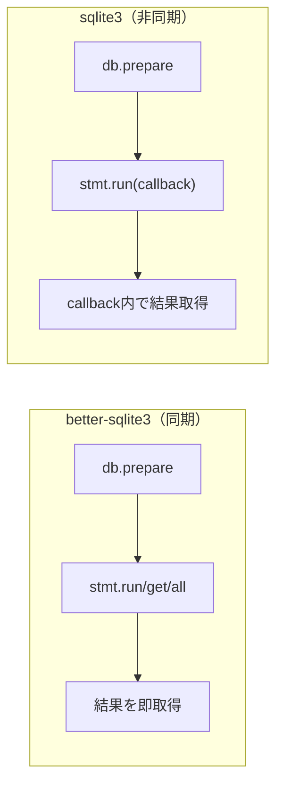
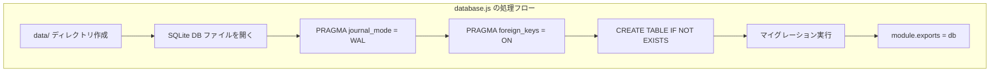
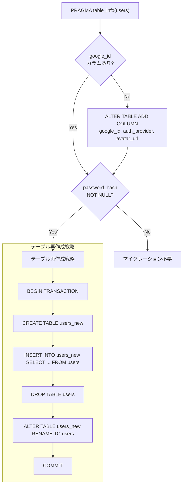

# SQLite + better-sqlite3 の基礎（技術解説ドキュメント）

## 概要

本ドキュメントでは、**SQLite データベースと better-sqlite3 ドライバ**について、User Management Dev Template の実装コードを引用しながら解説する。

PRPでは「SQLite データベース」「基本的な CRUD API」がスコープとして定義されている。本テンプレートでは `better-sqlite3` を採用しており、Node.js では珍しい**同期 API**を提供する点が特徴的である。Java/SQL の経験がある前提で、Node.js における SQLite の扱い方に焦点を当てる。

### このガイドで得られること

- better-sqlite3 の同期 API が非同期の `sqlite3` パッケージと異なる点
- WAL モード・外部キーなどの PRAGMA 設定の意味と効果
- プリペアドステートメントを使った安全な CRUD 操作
- 本テンプレートにおける DB 設定・マイグレーション手法

### 対象読者

- Node.js で SQLite を扱う方法を学びたい人
- better-sqlite3 の同期 API の利点を理解したい人

### 前提知識

- SQL（DDL/DML）は知っている前提（スキルレベル: advanced）
- DB 設計の基本は知っている前提（スキルレベル: advanced）
- SQLite の基礎概念は知っている前提（スキルレベル: intermediate）

---

## 目次

1. [結論: なぜ better-sqlite3 なのか](#1-結論-なぜ-better-sqlite3-なのか)
2. [DB 接続と PRAGMA 設定](#2-db-接続と-pragma-設定)
3. [プリペアドステートメントと CRUD 操作](#3-プリペアドステートメントと-crud-操作)
4. [マイグレーション戦略](#4-マイグレーション戦略)
5. [実装Tips・落とし穴](#5-実装tips落とし穴)
6. [まとめとおすすめの使い方](#6-まとめとおすすめの使い方)

---

## 1. 結論: なぜ better-sqlite3 なのか

Node.js で SQLite を使うパッケージは主に 2 つある:

| パッケージ | API | パフォーマンス | コールバック/Promise |
|-----------|-----|--------------|---------------------|
| `sqlite3` | 非同期 | 遅い | コールバック地獄になりがち |
| `better-sqlite3` | **同期** | **3-5倍高速** | 不要（戻り値で結果を受け取る） |

`better-sqlite3` は C++ バインディングで SQLite を直接呼び出すため、非同期オーバーヘッドがなく高速に動作する。Node.js の非同期モデルに反しているように見えるが、SQLite はファイルベース DB であり、ローカル I/O は十分に高速なため問題にならない。



本テンプレートのようなシンプルな Web アプリでは、同期 API のほうがコードが簡潔になり、エラーハンドリングも直感的になる。

---

## 2. DB 接続と PRAGMA 設定

### 全体構成



### コード例（コピペ可能）

本テンプレートの DB 初期化 (`src/config/database.js`):

```javascript
const Database = require('better-sqlite3');
const path = require('path');
const fs = require('fs');

// データディレクトリがなければ作成
const dataDir = path.join(__dirname, '..', 'data');
if (!fs.existsSync(dataDir)) {
  fs.mkdirSync(dataDir, { recursive: true });
}

// DB ファイルを開く（なければ自動作成される）
const db = new Database(path.join(dataDir, 'database.sqlite'));

// PRAGMA 設定
db.pragma('journal_mode = WAL');
db.pragma('foreign_keys = ON');
```

### PRAGMA の意味

| PRAGMA | 効果 | なぜ必要か |
|--------|------|----------|
| `journal_mode = WAL` | Write-Ahead Logging を有効化 | 読み取りと書き込みを同時実行可能にする。デフォルトの DELETE モードでは書き込み中に読み取りがブロックされる |
| `foreign_keys = ON` | 外部キー制約を有効化 | SQLite はデフォルトで外部キーを無視する。明示的に ON にしないと参照整合性が保証されない |

**Java との比較**: Spring Boot + PostgreSQL では DB 接続時に自動で FK 制約が有効だが、SQLite ではアプリケーション側で毎回 PRAGMA を設定する必要がある。これは SQLite の後方互換性を保つための設計上の決定。

---

## 3. プリペアドステートメントと CRUD 操作

### better-sqlite3 の主要メソッド

| メソッド | 戻り値 | 用途 |
|---------|--------|------|
| `db.prepare(sql)` | Statement オブジェクト | SQL をプリコンパイル |
| `stmt.run(params)` | `{ changes, lastInsertRowid }` | INSERT / UPDATE / DELETE |
| `stmt.get(params)` | 行オブジェクト or `undefined` | SELECT（1行） |
| `stmt.all(params)` | 配列 | SELECT（全行） |

### コード例（コピペ可能）

User モデル (`src/models/user.js`) の実装:

```javascript
const db = require('../config/database');

// INSERT: ユーザー作成
const create = (email, passwordHash, name) => {
  const stmt = db.prepare('INSERT INTO users (email, password_hash, name) VALUES (?, ?, ?)');
  const result = stmt.run(email, passwordHash, name);
  return { id: result.lastInsertRowid, email, name };
};

// SELECT (1行): メールでユーザー検索
const findByEmail = (email) => {
  const stmt = db.prepare('SELECT * FROM users WHERE email = ?');
  return stmt.get(email);  // 見つからなければ undefined
};

// SELECT (1行): IDでユーザー検索（パスワードハッシュ除外）
const findById = (id) => {
  const stmt = db.prepare(
    'SELECT id, email, name, auth_provider, avatar_url, created_at, updated_at FROM users WHERE id = ?'
  );
  return stmt.get(id);
};

// SELECT (全行): ユーザー一覧
const findAll = () => {
  const stmt = db.prepare(
    'SELECT id, email, name, auth_provider, avatar_url, created_at, updated_at FROM users'
  );
  return stmt.all();
};

// UPDATE: ユーザー情報更新
const update = (id, { name, email }) => {
  const stmt = db.prepare(
    "UPDATE users SET name = ?, email = ?, updated_at = datetime('now') WHERE id = ?"
  );
  stmt.run(name, email, id);
  return findById(id);
};

// DELETE: ユーザー削除
const remove = (id) => {
  const stmt = db.prepare('DELETE FROM users WHERE id = ?');
  return stmt.run(id);
};
```

**ポイント**:
- `?` プレースホルダで SQL インジェクションを防止。文字列結合で SQL を組み立てては絶対にダメ
- `stmt.run()` の戻り値 `lastInsertRowid` は `BigInt` 型だが、JavaScript の `Number` 範囲内であれば自動変換される
- `findById` では `password_hash` をカラム指定で除外している（API レスポンスにハッシュを含めない設計）

---

## 4. マイグレーション戦略

### SQLite の ALTER TABLE 制約

SQLite の `ALTER TABLE` は以下の操作しかサポートしない:
- `ADD COLUMN`（カラム追加）
- `RENAME TABLE`（テーブル名変更）
- `RENAME COLUMN`（カラム名変更、3.25.0+）

**カラムの型変更、NOT NULL の削除、カラム削除（3.35.0 未満）はできない。**

本テンプレートではこの制約に対応するため、以下のマイグレーション戦略を採用:



### コード例（コピペ可能）

`src/config/database.js` のマイグレーション部分:

```javascript
// カラム存在チェック
const columns = db.pragma('table_info(users)').map(c => c.name);

if (!columns.includes('google_id')) {
  db.exec(`ALTER TABLE users ADD COLUMN google_id TEXT UNIQUE`);
}
if (!columns.includes('auth_provider')) {
  db.exec(`ALTER TABLE users ADD COLUMN auth_provider TEXT DEFAULT 'email'`);
}
if (!columns.includes('avatar_url')) {
  db.exec(`ALTER TABLE users ADD COLUMN avatar_url TEXT`);
}

// password_hash の NOT NULL 制約を外す（テーブル再作成）
const passwordCol = db.pragma('table_info(users)').find(c => c.name === 'password_hash');
if (passwordCol && passwordCol.notnull === 1) {
  db.exec(`
    BEGIN TRANSACTION;
    CREATE TABLE users_new (
      id INTEGER PRIMARY KEY AUTOINCREMENT,
      email TEXT UNIQUE NOT NULL,
      password_hash TEXT,
      name TEXT NOT NULL,
      google_id TEXT UNIQUE,
      auth_provider TEXT DEFAULT 'email',
      avatar_url TEXT,
      created_at TEXT DEFAULT (datetime('now')),
      updated_at TEXT DEFAULT (datetime('now'))
    );
    INSERT INTO users_new (id, email, password_hash, name, google_id, auth_provider, avatar_url, created_at, updated_at)
      SELECT id, email, password_hash, name, google_id, auth_provider, avatar_url, created_at, updated_at FROM users;
    DROP TABLE users;
    ALTER TABLE users_new RENAME TO users;
    COMMIT;
  `);
}
```

**Java (Flyway/Liquibase) との比較**: Spring Boot ではマイグレーションツールが SQL ファイルをバージョン管理するが、本テンプレートではアプリ起動時にコード内で `PRAGMA table_info` を使ってスキーマを検査し、必要に応じてマイグレーションを実行するシンプルな方式を採用している。

---

## 5. 実装Tips・落とし穴

### 注意点

| 項目 | 内容 |
|------|------|
| 同時書き込みの制約 | WAL モードでも書き込みは 1 プロセスのみ。マルチプロセス構成（PM2 クラスタモード等）では書き込みエラーが発生する可能性がある |
| C++ ネイティブモジュール | `better-sqlite3` は C++ ビルドが必要。Node.js のメジャーバージョンアップ時に `npm rebuild` が必要になる場合がある |
| BigInt の罠 | `lastInsertRowid` は `BigInt` を返す場合がある。JSON.stringify で `BigInt` はエラーになるため注意 |
| トランザクションの明示 | 複数の書き込み操作をアトミックに実行する場合は `db.transaction()` を使う |

### デバッグ観点

- **DB ファイルが作成されない**: `dataDir` のパスが正しいか、書き込み権限があるか確認
- **UNIQUE 制約エラー**: `SQLITE_CONSTRAINT_UNIQUE` がスローされる。try-catch で捕捉して 400 レスポンスを返す
- **テーブルが存在しない**: `database.js` が `require` される前にモデルが読み込まれていないか確認（Node.js の `require` は同期的に実行されるため、通常は問題にならない）
- **WAL ファイル**: `database.sqlite-wal` と `database.sqlite-shm` ファイルが自動生成される。これらは正常な WAL モードの副産物でありバグではない

### 検証チェックリスト

- [ ] `src/data/database.sqlite` ファイルが作成されている
- [ ] `database.sqlite-wal` ファイルが存在する（WAL モードが有効）
- [ ] ユーザー登録後に `SELECT * FROM users` でデータが確認できる
- [ ] 重複メールでの登録が `SQLITE_CONSTRAINT_UNIQUE` エラーになる
- [ ] マイグレーション後に `google_id`, `auth_provider`, `avatar_url` カラムが追加されている
- [ ] `password_hash` カラムが NULL 許容になっている

---

## 6. まとめとおすすめの使い方

### 本ドキュメントで学んだこと

| トピック | 内容 |
|---------|------|
| better-sqlite3 の同期 API | `prepare` → `run/get/all` のシンプルなパターンで CRUD を実装 |
| PRAGMA 設定 | WAL モードと外部キー有効化が必須設定 |
| プリペアドステートメント | `?` プレースホルダで SQL インジェクション防止 |
| マイグレーション | `PRAGMA table_info` でスキーマ検査し、テーブル再作成で制約変更に対応 |

### おすすめの活用方法

| シナリオ | 活用方法 |
|---------|---------|
| プロトタイプ開発 | SQLite + better-sqlite3 で即座に DB 付きアプリを立ち上げる。外部 DB サーバー不要 |
| PostgreSQL への移行 | SQL 構文を PostgreSQL 互換に書き換え、ドライバを `pg` に変更するだけ。モデル層のインターフェースは維持できる |
| テスト | インメモリ DB（`new Database(':memory:')`）を使うとテストごとにクリーンな DB を用意できる |

### 次に学ぶべきこと

- [MVC アーキテクチャパターン](./04-mvc-architecture.md) - models/ の役割をアーキテクチャ全体の中で理解する
- [Express + セッション認証の仕組み](./01-express-session-auth.md) - DB と連携した認証フローの全体像

---

## 補足リンク

- [better-sqlite3 公式ドキュメント](https://github.com/WiseLibs/better-sqlite3/blob/master/docs/api.md)
- [SQLite 公式 - WAL モード](https://www.sqlite.org/wal.html)
- [SQLite 公式 - ALTER TABLE](https://www.sqlite.org/lang_altertable.html)

---

*Generated by Tech-Educator | Skill Level: intermediate (SQLite), advanced (SQL, DB設計) | PRPからの関連: SQLite データベース、基本的な CRUD API*
