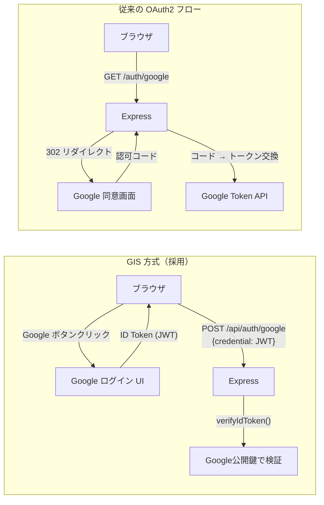
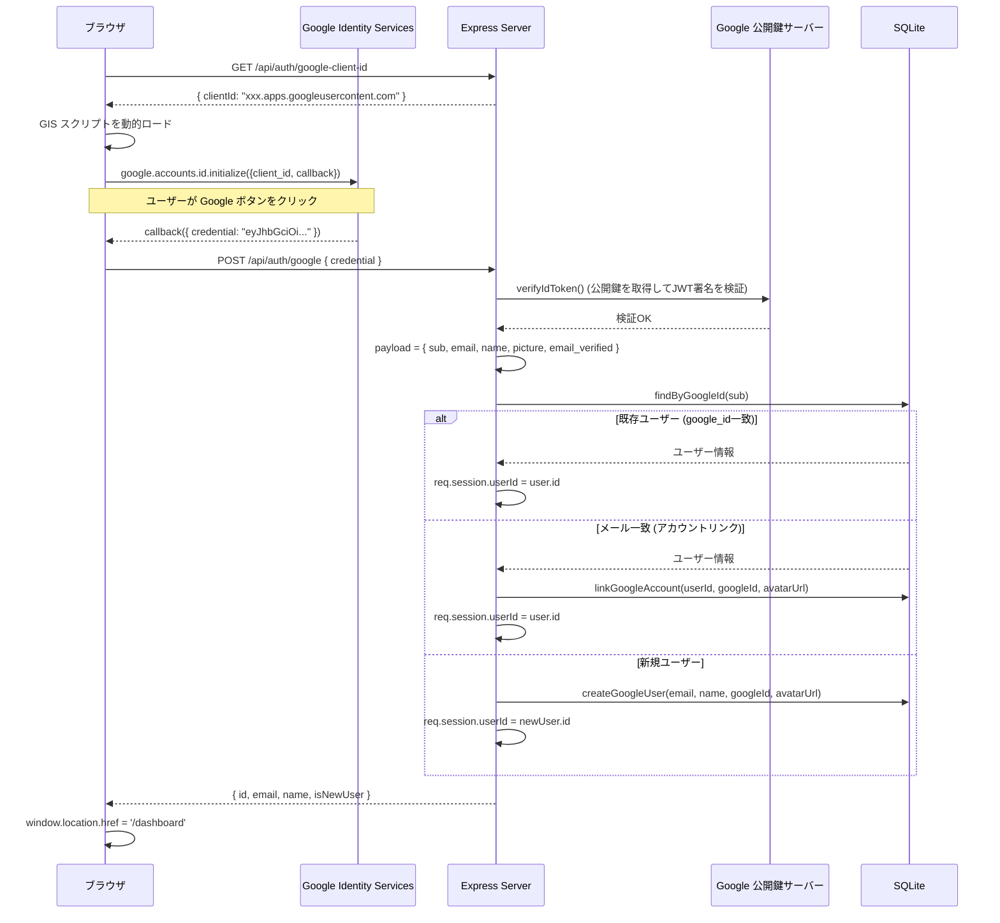

# Google OAuth (GIS) の仕組み（技術解説ドキュメント）

## 概要

本ドキュメントでは、**Google Identity Services (GIS) を使った OAuth 認証**について、User Management Dev Template の実装コードと調査結果を引用しながら解説する。

PRPの初期スコープでは OAuth は Out of Scope だったが、テンプレートの汎用性を高めるためにグレースフルデグラデーション方式で Google OAuth を追加実装した。`GOOGLE_CLIENT_ID` が未設定であれば従来の Email/Password 認証のみで動作し、設定すれば Google ログインボタンが自動表示される。

### このガイドで得られること

- GIS (Google Identity Services) の ID Token 方式が従来の OAuth 認可コードフローと異なる点
- `verifyIdToken` による JWT 検証の仕組み
- `email_verified` チェックの重要性とアカウントリンクの安全性
- グレースフルデグラデーションの設計パターン

### 対象読者

- Google ログインを Web アプリに組み込みたい人
- OAuth の仕組みを実装レベルで理解したい人

### 前提知識

- RESTful API は知っている前提（スキルレベル: advanced）
- 認証の基本概念（セッション、Cookie）は知っている前提（スキルレベル: intermediate）
- Express の基本的な使い方は知っている前提（スキルレベル: intermediate）

---

## 目次

1. [結論: GIS 方式を選んだ理由](#1-結論-gis-方式を選んだ理由)
2. [GIS の ID Token フロー](#2-gis-の-id-token-フロー)
3. [バックエンドでのトークン検証](#3-バックエンドでのトークン検証)
4. [グレースフルデグラデーション](#4-グレースフルデグラデーション)
5. [実装Tips・落とし穴](#5-実装tips落とし穴)
6. [まとめとおすすめの使い方](#6-まとめとおすすめの使い方)

---

## 1. 結論: GIS 方式を選んだ理由

本テンプレートでは 3 つの実装方式を検討し、GIS + `google-auth-library` を採用した。

| 観点 | GIS (採用) | Passport.js | 手動 OAuth2 |
|------|-----------|-------------|-------------|
| 追加パッケージ | 1個 | 2個 | 1個 |
| 既存コードへの影響 | 最小 | 中（serialize/deserialize） | 中 |
| UX | ポップアップ/ワンタップ | ページリダイレクト | ページリダイレクト |
| Google 推奨度 | 最も推奨（2025-2026 現在） | 旧式 | - |
| クライアントシークレット | 不要 | 必要 | 必要 |

**決定的な理由**: GIS 方式はクライアントシークレットが不要で環境変数が `GOOGLE_CLIENT_ID` 1つだけで済む。テンプレートとして配布する際のセットアップの手間が最小になる。



---

## 2. GIS の ID Token フロー

### 処理の全体像



### ID Token (JWT) の中身

Google の ID Token は以下のようなペイロードを持つ JWT:

```json
{
  "iss": "https://accounts.google.com",
  "sub": "1234567890",
  "email": "user@gmail.com",
  "email_verified": true,
  "name": "Yuta Nakanishi",
  "picture": "https://lh3.googleusercontent.com/...",
  "aud": "xxx.apps.googleusercontent.com",
  "exp": 1706745600
}
```

| フィールド | 用途 |
|-----------|------|
| `sub` | Google アカウント固有の不変 ID。これを `google_id` として DB に保存する |
| `email` | メールアドレス。変更される可能性があるため主キーにしない |
| `email_verified` | メール検証済みかどうか。アカウントリンク時に必ずチェックする |
| `aud` | このトークンの対象アプリ。自分の Client ID と一致するか検証必須 |

---

## 3. バックエンドでのトークン検証

### コード例（コピペ可能）

`src/routes/auth.js` の Google 認証エンドポイント:

```javascript
const { OAuth2Client } = require('google-auth-library');

router.post('/google', async (req, res) => {
  try {
    const clientId = process.env.GOOGLE_CLIENT_ID;
    if (!clientId) {
      return res.status(400).json({ error: 'Google auth is not configured' });
    }

    const { credential } = req.body;
    if (!credential) {
      return res.status(400).json({ error: 'Credential is required' });
    }

    const client = new OAuth2Client(clientId);
    let ticket;
    try {
      ticket = await client.verifyIdToken({
        idToken: credential,
        audience: clientId,  // aud フィールドが自分の Client ID と一致するか検証
      });
    } catch (err) {
      return res.status(401).json({ error: 'Invalid Google token' });
    }

    const payload = ticket.getPayload();
    const googleId = payload.sub;
    const email = payload.email;
    const emailVerified = payload.email_verified;
    const name = payload.name || (email ? email.split('@')[0] : 'User');
    const avatarUrl = payload.picture || null;

    if (!email) {
      return res.status(400).json({ error: 'Email is required from Google account' });
    }

    // 1. google_id で検索（既存の Google ユーザー）
    let user = User.findByGoogleId(googleId);
    if (user) {
      req.session.userId = user.id;
      return res.json({ id: user.id, email: user.email, name: user.name, isNewUser: false });
    }

    // 2. email で検索（アカウントリンク）
    user = User.findByEmail(email);
    if (user) {
      // email_verified が false の場合はリンクしない（セキュリティ対策）
      if (!emailVerified) {
        return res.status(403).json({ error: 'Google email must be verified to link to existing account' });
      }
      User.linkGoogleAccount(user.id, googleId, avatarUrl);
      req.session.userId = user.id;
      return res.json({ id: user.id, email: user.email, name: user.name, isNewUser: false });
    }

    // 3. 新規ユーザー作成
    const newUser = User.createGoogleUser(email, name, googleId, avatarUrl);
    req.session.userId = newUser.id;
    return res.status(201).json({ id: newUser.id, email: newUser.email, name: newUser.name, isNewUser: true });
  } catch (err) {
    res.status(500).json({ error: 'Server error' });
  }
});
```

### email_verified チェックの重要性

アカウントリンク（既存の Email/Password ユーザーと Google アカウントの紐付け）時に `email_verified` をチェックしないと、以下の攻撃が成立する可能性がある:

1. 攻撃者が `victim@example.com` で Google アカウントを作成（メール未検証）
2. 攻撃者がそのアカウントで Google ログイン
3. `email_verified` チェックがなければ、被害者の既存アカウントに攻撃者の Google アカウントがリンクされる
4. 攻撃者が Google ログインで被害者のアカウントにアクセス可能になる

---

## 4. グレースフルデグラデーション

### 設計思想

テンプレートとして配布する以上、Google OAuth の設定は任意であるべき。設定されていなければ従来の Email/Password 認証のみで完全に動作する。

```mermaid
flowchart TB
    A[アプリ起動] --> B{GOOGLE_CLIENT_ID<br>設定あり?}
    B -->|Yes| C["/api/auth/google-client-id → { clientId: 'xxx' }"]
    B -->|No| D["/api/auth/google-client-id → { clientId: null }"]

    C --> E[フロントエンド: GIS スクリプトをロード]
    E --> F[Google ボタン表示]

    D --> G[フロントエンド: initGoogleSignIn() が即 return]
    G --> H["Google ボタン非表示（display:none のまま）"]

    F --> I[Email/Password + Google ログイン 両方使える]
    H --> J[Email/Password ログインのみ]
```

### バックエンド側

```javascript
// Client ID を返す API
router.get('/google-client-id', (req, res) => {
  const clientId = process.env.GOOGLE_CLIENT_ID || null;
  res.json({ clientId });
});

// Google 認証エンドポイント（未設定なら 400）
router.post('/google', async (req, res) => {
  const clientId = process.env.GOOGLE_CLIENT_ID;
  if (!clientId) {
    return res.status(400).json({ error: 'Google auth is not configured' });
  }
  // ...
});
```

### フロントエンド側

```javascript
async function initGoogleSignIn() {
  try {
    const res = await fetch('/api/auth/google-client-id');
    const { clientId } = await res.json();
    if (!clientId) return;  // ここで即リターン → ボタン非表示のまま

    document.getElementById('google-signin-container').style.display = 'block';

    const script = document.createElement('script');
    script.src = 'https://accounts.google.com/gsi/client';
    script.onload = () => {
      google.accounts.id.initialize({
        client_id: clientId,
        callback: handleGoogleResponse
      });
      google.accounts.id.renderButton(
        document.getElementById('g_id_signin'),
        { theme: 'outline', size: 'large', width: '100%', text: 'signin_with' }
      );
    };
    document.head.appendChild(script);
  } catch {
    // Google Sign-In は任意機能なのでエラーは握りつぶす
  }
}
```

**ポイント**:
- GIS の JavaScript (`accounts.google.com/gsi/client`) は Client ID が存在する場合にのみ動的にロードする
- 初期 HTML では `google-signin-container` は `display:none` で隠してある

---

## 5. 実装Tips・落とし穴

### 注意点

| 項目 | 内容 |
|------|------|
| `sub` と `email` の使い分け | `sub` (google_id) は不変、`email` は変更可能。DB の主キーやユーザー識別には必ず `sub` を使う |
| Google Cloud Console の JavaScript オリジン | `http://localhost:3000` を承認済み JavaScript オリジンに登録しないと、GIS が動作しない |
| リダイレクト URI は不要 | GIS の ID Token 方式ではリダイレクト URI の設定は不要（認可コードフローと混同しないこと） |
| token の有効期限 | ID Token の有効期限は約 1 時間。検証時に `verifyIdToken` が自動チェックするので手動確認は不要 |
| パスワード未設定ユーザー | Google のみで登録したユーザーは `password_hash = NULL`。Email/Password ログインを試みた場合のエラーメッセージを明確にする |

### デバッグ観点

- **Google ボタンが表示されない**: DevTools > Console で `initGoogleSignIn` のエラーを確認。`/api/auth/google-client-id` が `{ clientId: null }` を返していないか
- **「Invalid Google token」エラー**: `audience` に設定した Client ID が Google Cloud Console のものと一致しているか確認
- **アカウントリンクが 403**: `email_verified` が `false` の場合に発生する。テスト用 Google アカウントのメールが検証済みか確認
- **CORS エラー**: GIS スクリプトは Google のドメインからロードされるが、callback は同一オリジンの JavaScript 関数として呼び出されるため CORS は発生しない

### 検証チェックリスト

- [ ] `GOOGLE_CLIENT_ID` 未設定で Google ボタンが表示されない
- [ ] `GOOGLE_CLIENT_ID` 設定済みで Google ボタンが表示される
- [ ] Google ログイン成功後、ダッシュボードにリダイレクトされる
- [ ] 新規 Google ユーザーの DB レコードが `auth_provider = 'google'`, `password_hash = NULL` で作成されている
- [ ] 既存 Email/Password ユーザーと同じメールで Google ログインすると `auth_provider = 'both'` に更新される
- [ ] Google のみユーザーが Email/Password ログインを試みると「This account uses Google login」エラーが返る

---

## 6. まとめとおすすめの使い方

### 本ドキュメントで学んだこと

| トピック | 内容 |
|---------|------|
| GIS の ID Token フロー | フロントエンドで JWT を受け取り、バックエンドで公開鍵検証するシンプルな方式 |
| verifyIdToken | audience チェック込みでトークンの真正性を検証する |
| email_verified | アカウントリンク時の必須チェック。省略するとアカウント乗っ取りリスクがある |
| グレースフルデグラデーション | 環境変数 1 つで機能の ON/OFF を切り替える設計パターン |

### おすすめの活用方法

| シナリオ | 活用方法 |
|---------|---------|
| 個人プロジェクト | Google Cloud Console で Client ID を取得し `.env` に設定するだけで Google ログインが有効になる |
| チーム開発 | `.env.example` に `GOOGLE_CLIENT_ID=` を含めておき、各開発者が自分の Client ID を設定する |
| 本番デプロイ | 本番ドメインを JavaScript オリジンに追加し、`secure: true` Cookie 設定と組み合わせる |

### 次に学ぶべきこと

- [Web セキュリティ基礎](./05-web-security-basics.md) - CSRF 対策や Cookie の安全な設定について
- [Express + セッション認証の仕組み](./01-express-session-auth.md) - Google ログイン後のセッション管理の詳細

---

## 補足リンク

- [Google Identity Services 公式ドキュメント](https://developers.google.com/identity/gsi/web/guides/overview)
- [ID Token 検証ガイド](https://developers.google.com/identity/gsi/web/guides/verify-google-id-token)
- [google-auth-library npm](https://www.npmjs.com/package/google-auth-library)
- [Google Cloud Console](https://console.cloud.google.com/)

---

*Generated by Tech-Educator | Skill Level: intermediate (Authentication, Express) | PRPからの関連: OAuth連携（拡張スコープ）、グレースフルデグラデーション設計*
