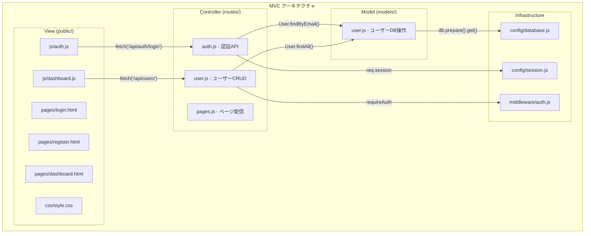
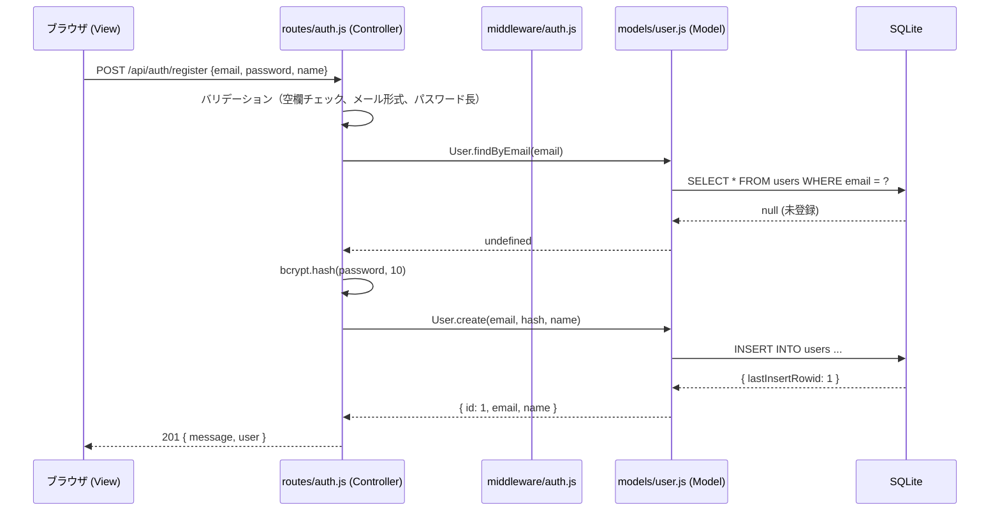

# MVC アーキテクチャパターン（技術解説ドキュメント）

## 概要

本ドキュメントでは、**MVC (Model-View-Controller) アーキテクチャパターン**について、User Management Dev Template のディレクトリ構造とコードを引用しながら解説する。

PRPの Architecture Notes には「シンプルなMVC構造」「テンプレートとして拡張しやすい設計」と記載されている。本テンプレートでは `models/` (Model)、`public/pages/` (View)、`routes/` (Controller) の 3 層分離を採用しており、ファイルの追加だけで機能を拡張できる構造になっている。

### このガイドで得られること

- MVC パターンにおける各層の責務と依存関係
- 本テンプレートでの具体的なファイル配置とデータの流れ
- 静的 HTML + API 通信という View 層の設計選択の理由
- 新機能追加時の拡張パターン

### 対象読者

- Express アプリの設計パターンを学びたい人
- テンプレートに新機能を追加する際のガイドラインを知りたい人

### 前提知識

- RESTful API の設計は知っている前提（スキルレベル: advanced）
- Clean Architecture / 設計パターンの基本概念は知っている前提（スキルレベル: intermediate）
- Express の middleware の概念は知っている前提（スキルレベル: intermediate）

---

## 目次

1. [結論: 本テンプレートの MVC 構造](#1-結論-本テンプレートの-mvc-構造)
2. [Model 層: データアクセスの抽象化](#2-model-層-データアクセスの抽象化)
3. [Controller 層 (Routes): リクエスト処理](#3-controller-層-routes-リクエスト処理)
4. [View 層: 静的 HTML + Fetch API](#4-view-層-静的-html--fetch-api)
5. [実装Tips・落とし穴](#5-実装tips落とし穴)
6. [まとめとおすすめの使い方](#6-まとめとおすすめの使い方)

---

## 1. 結論: 本テンプレートの MVC 構造

### ディレクトリとMVCの対応



### 主要コンポーネントの責務

| 層 | ディレクトリ | 責務 | やらないこと |
|---|------------|------|-------------|
| Model | `models/` | DB 操作のみ。SQL の実行とデータの取得/変換 | HTTP レスポンス、バリデーション、セッション管理 |
| Controller | `routes/` | リクエストの受付、バリデーション、Model の呼び出し、レスポンスの返却 | SQL の直接実行、HTML の生成 |
| View | `public/` | UI の表示、ユーザー入力の取得、API との通信 | DB アクセス、サーバーサイドロジック |
| Middleware | `middleware/` | 横断的関心事（認証チェック等） | ビジネスロジック |
| Config | `config/` | DB 接続、セッション設定等のインフラ設定 | ビジネスロジック |

---

## 2. Model 層: データアクセスの抽象化

### 設計原則

Model 層は「DB に対する操作」だけを担当する。HTTP のことは一切知らない。

```javascript
// src/models/user.js

// CREATE
const create = (email, passwordHash, name) => {
  const stmt = db.prepare('INSERT INTO users (email, password_hash, name) VALUES (?, ?, ?)');
  const result = stmt.run(email, passwordHash, name);
  return { id: result.lastInsertRowid, email, name };
};

// READ (単体)
const findByEmail = (email) => {
  const stmt = db.prepare('SELECT * FROM users WHERE email = ?');
  return stmt.get(email);
};

// READ (一覧)
const findAll = () => {
  const stmt = db.prepare(
    'SELECT id, email, name, auth_provider, avatar_url, created_at, updated_at FROM users'
  );
  return stmt.all();
};

// UPDATE
const update = (id, { name, email }) => {
  const stmt = db.prepare("UPDATE users SET name = ?, email = ?, updated_at = datetime('now') WHERE id = ?");
  stmt.run(name, email, id);
  return findById(id);
};

// DELETE
const remove = (id) => {
  const stmt = db.prepare('DELETE FROM users WHERE id = ?');
  return stmt.run(id);
};
```

**Spring Boot との比較**: Spring の Repository 層に相当する。JPA の `findByEmail` メソッドと同様の命名規則を使っている。ただし、Spring では `@Repository` アノテーションと JPA が SQL を自動生成するのに対し、本テンプレートでは SQL を直接記述する。

### Google OAuth 追加時のモデル拡張例

```javascript
// 既存の module.exports に追加するだけ
const findByGoogleId = (googleId) => {
  const stmt = db.prepare('SELECT * FROM users WHERE google_id = ?');
  return stmt.get(googleId);
};

const createGoogleUser = (email, name, googleId, avatarUrl) => {
  const stmt = db.prepare(
    'INSERT INTO users (email, password_hash, name, google_id, auth_provider, avatar_url) VALUES (?, NULL, ?, ?, ?, ?)'
  );
  const result = stmt.run(email, name, googleId, 'google', avatarUrl);
  return { id: result.lastInsertRowid, email, name, isNewUser: true };
};

const linkGoogleAccount = (userId, googleId, avatarUrl) => {
  const stmt = db.prepare(
    "UPDATE users SET google_id = ?, auth_provider = 'both', avatar_url = COALESCE(avatar_url, ?), updated_at = datetime('now') WHERE id = ?"
  );
  stmt.run(googleId, avatarUrl, userId);
  return findById(userId);
};
```

---

## 3. Controller 層 (Routes): リクエスト処理

### リクエスト処理フロー



### Controller の責務

`routes/auth.js` の登録エンドポイントを例にとると:

```javascript
router.post('/register', async (req, res) => {
  try {
    // 1. リクエストボディの取得
    const { email, password, name } = req.body;

    // 2. バリデーション（Controller の責務）
    if (!email || !password || !name) {
      return res.status(400).json({ error: 'All fields are required' });
    }
    const emailRegex = /^[^\s@]+@[^\s@]+\.[^\s@]+$/;
    if (!emailRegex.test(email)) {
      return res.status(400).json({ error: 'Invalid email format' });
    }
    if (password.length < 6) {
      return res.status(400).json({ error: 'Password must be at least 6 characters' });
    }

    // 3. ビジネスロジック（Model を呼び出す）
    const existing = User.findByEmail(email);
    if (existing) {
      return res.status(400).json({ error: 'Email already registered' });
    }

    // 4. パスワードハッシュ化（アプリケーションロジック）
    const passwordHash = await bcrypt.hash(password, 10);

    // 5. Model に委譲（DB 操作は Model の責務）
    const user = User.create(email, passwordHash, name);

    // 6. レスポンス返却（Controller の責務）
    res.status(201).json({ message: 'Registration successful', user });
  } catch (err) {
    res.status(500).json({ error: 'Server error' });
  }
});
```

### app.js でのルーティング登録

```javascript
// src/app.js
const authRoutes = require('./routes/auth');
const userRoutes = require('./routes/user');
const pageRoutes = require('./routes/pages');

app.use('/api/auth', authRoutes);   // 認証系 API
app.use('/api/users', userRoutes);  // ユーザー CRUD API
app.use('/', pageRoutes);           // ページ配信
```

**ポイント**: パスのプレフィックスで関心を分離。新しいリソース（例: `routes/stripe.js`）を追加する場合は `app.use('/api/stripe', stripeRoutes)` を 1 行追加するだけ。

---

## 4. View 層: 静的 HTML + Fetch API

### 設計選択: なぜテンプレートエンジン (EJS) を使わないのか

| 方式 | メリット | デメリット |
|------|---------|----------|
| 静的 HTML + API (本テンプレート) | フロントとバックの完全分離。将来 React/Vue への移行が容易 | 初期表示時にデータ取得の追加リクエストが必要 |
| EJS/Pug 等のテンプレートエンジン | サーバーサイドレンダリングで初期表示が速い | フロント/バックが密結合。SPA 移行時に書き直しが必要 |

本テンプレートでは「テンプレートとして拡張しやすい設計」という PRP の方針に基づき、静的 HTML + API 方式を採用している。

### データの流れ

```javascript
// src/public/js/auth.js - View 層
loginForm.addEventListener('submit', async (e) => {
  e.preventDefault();

  // 1. DOM からユーザー入力を取得
  const email = document.getElementById('email').value;
  const password = document.getElementById('password').value;

  // 2. クライアント側バリデーション（最低限）
  if (!email || !password) {
    return showError('All fields are required');
  }

  // 3. API 呼び出し（Controller へ）
  const res = await fetch('/api/auth/login', {
    method: 'POST',
    headers: { 'Content-Type': 'application/json' },
    body: JSON.stringify({ email, password })
  });

  // 4. レスポンス処理
  const data = await res.json();
  if (!res.ok) {
    return showError(data.error || 'Login failed');
  }

  // 5. 画面遷移
  window.location.href = '/dashboard';
});
```

### ページ配信ルート

```javascript
// src/routes/pages.js (Controller) - HTML ファイルを配信
router.get('/login', (req, res) => {
  res.sendFile(path.join(__dirname, '..', 'public', 'pages', 'login.html'));
});

router.get('/dashboard', requireAuthPage, (req, res) => {
  res.sendFile(path.join(__dirname, '..', 'public', 'pages', 'dashboard.html'));
});
```

`express.static` で `public/` を公開し、HTML は `pages.js` ルートで配信。`dashboard` は `requireAuthPage` ミドルウェアで認証チェック付き。

---

## 5. 実装Tips・落とし穴

### 注意点

| 項目 | 内容 |
|------|------|
| Model に HTTP の知識を持たせない | `res.status(400).json(...)` を Model 内で書かない。Model は純粋なデータ操作のみ |
| Controller の肥大化 | バリデーションロジックが複雑になったら `validators/` ディレクトリに切り出す |
| ミドルウェアの順序 | `app.use(sessionMiddleware)` は `app.use('/api/auth', authRoutes)` より前に置く。順序を間違えるとセッションが機能しない |
| `express.static` の位置 | `app.use(express.static(...))` はルーティングより前に置く。ただし、静的ファイルとルートのパスが競合しないよう注意 |

### 新機能追加時の拡張パターン

例: Stripe 課金機能を追加する場合

| ステップ | 操作 | ファイル |
|---------|------|---------|
| 1 | モデル作成 | `src/models/subscription.js` を新規作成 |
| 2 | ルート作成 | `src/routes/stripe.js` を新規作成 |
| 3 | ルート登録 | `src/app.js` に `app.use('/api/stripe', stripeRoutes)` を追加 |
| 4 | DB 変更 | `src/config/database.js` に `subscriptions` テーブルの CREATE を追加 |
| 5 | フロント | `src/public/pages/pricing.html` と `src/public/js/pricing.js` を追加 |

既存ファイルへの変更は `app.js` と `database.js` の 2 ファイルのみ。

### デバッグ観点

- **404 が返る**: ルートが `app.js` に登録されているか確認。パスのプレフィックスが正しいか確認
- **ミドルウェアが効かない**: `app.use` の順序を確認。Express はミドルウェアを登録順に実行する
- **Model の変更が反映されない**: `require` のキャッシュにより、Node.js プロセスを再起動する必要がある

### 検証チェックリスト

- [ ] `routes/` のファイルが `app.js` に登録されている
- [ ] Model 内に `req`, `res` オブジェクトへの参照がない
- [ ] 認証が必要なルートに `requireAuth` または `requireAuthPage` が設定されている
- [ ] 新しい HTML ページに対応するルートが `pages.js` に追加されている
- [ ] `public/js/` の JavaScript が正しい API エンドポイントを呼んでいる

---

## 6. まとめとおすすめの使い方

### 本ドキュメントで学んだこと

| トピック | 内容 |
|---------|------|
| MVC の責務分離 | Model (DB操作) / Controller (リクエスト処理) / View (UI) の明確な分離 |
| Express での MVC 実現 | `models/` + `routes/` + `public/` のディレクトリ構造 |
| 静的 HTML + API 方式 | テンプレートエンジンを使わず、フロント/バックを完全分離する設計選択 |
| 拡張パターン | モデル + ルート + app.js 登録の 3 ステップで新機能を追加 |

### おすすめの活用方法

| シナリオ | 活用方法 |
|---------|---------|
| 新規機能追加 | Model → Route → app.js 登録 → フロントの順で実装する |
| React/Vue への移行 | `public/` を削除し、別プロジェクトとしてフロントを作成。API (`/api/*`) はそのまま使える |
| テスト追加 | Model 層は HTTP に依存しないため、単体テストが書きやすい |

### 次に学ぶべきこと

- [SQLite + better-sqlite3 の基礎](./02-sqlite-better-sqlite3.md) - Model 層が使う DB ドライバの詳細
- [Express + セッション認証の仕組み](./01-express-session-auth.md) - Middleware 層の認証チェックの詳細

---

## 補足リンク

- [Express 公式 - ルーティングガイド](https://expressjs.com/en/guide/routing.html)
- [Express 公式 - ミドルウェアの使い方](https://expressjs.com/en/guide/using-middleware.html)
- [MDN - MVC アーキテクチャ](https://developer.mozilla.org/ja/docs/Glossary/MVC)

---

*Generated by Tech-Educator | Skill Level: intermediate (Express, Clean Architecture, Design Patterns) | PRPからの関連: シンプルなMVC構造、テンプレートとして拡張しやすい設計*
