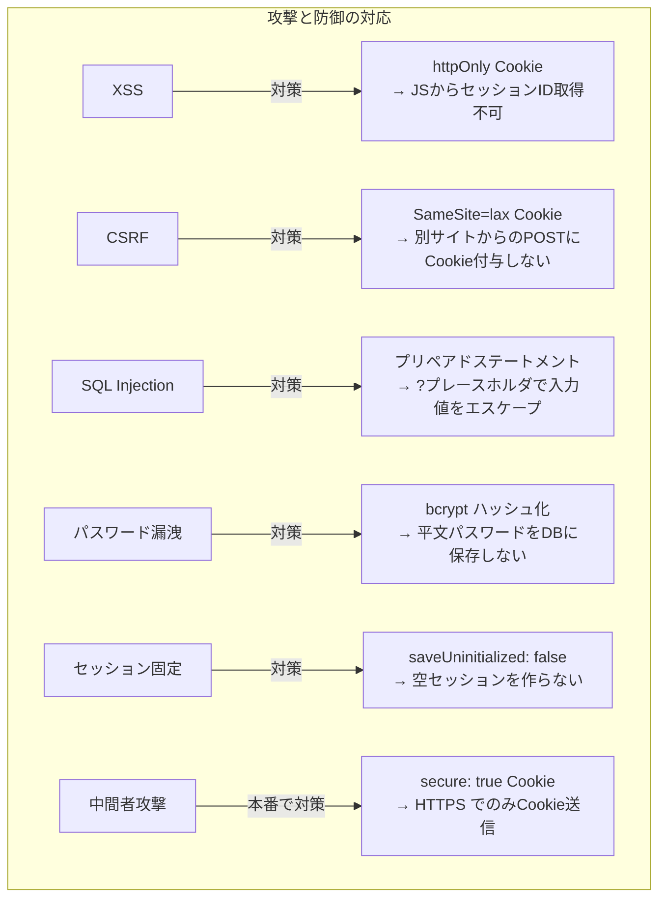
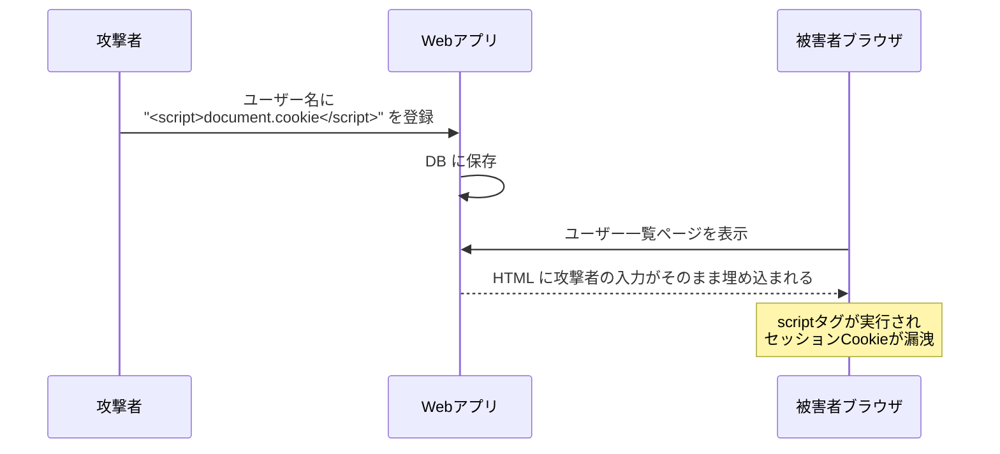
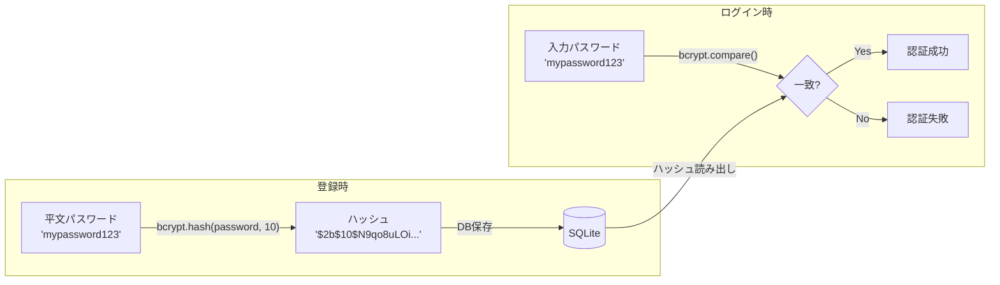

# Web セキュリティ基礎（技術解説ドキュメント）

## 概要

本ドキュメントでは、**Web アプリケーションのセキュリティ基礎**について、User Management Dev Template で実装されているセキュリティ対策を引用しながら解説する。

PRPでは認証機能をスコープに含んでおり、ユーザーのパスワードやセッション情報を扱う以上、XSS、CSRF、SQL インジェクション等の攻撃への対策は必須である。本テンプレートに既に組み込まれている対策と、本番環境で追加すべき対策を体系的に整理する。

### このガイドで得られること

- XSS (Cross-Site Scripting) の攻撃手法と防御策
- CSRF (Cross-Site Request Forgery) の仕組みと SameSite Cookie による軽減
- Cookie の各属性 (httpOnly, secure, sameSite) がセキュリティに与える影響
- bcrypt によるパスワードハッシュ化の意味と SQL インジェクション対策

### 対象読者

- Web アプリのセキュリティ対策を体系的に学びたい人
- 本テンプレートを本番環境にデプロイする際のセキュリティ確認をしたい人

### 前提知識

- HTTP リクエスト/レスポンスの仕組みは知っている前提
- Express + セッション認証の仕組みは知っている前提（[01-express-session-auth.md](./01-express-session-auth.md) 参照）

---

## 目次

1. [結論: 本テンプレートのセキュリティ対策一覧](#1-結論-本テンプレートのセキュリティ対策一覧)
2. [XSS (Cross-Site Scripting) 対策](#2-xss-cross-site-scripting-対策)
3. [CSRF (Cross-Site Request Forgery) 対策](#3-csrf-cross-site-request-forgery-対策)
4. [パスワードハッシュ化と SQL インジェクション対策](#4-パスワードハッシュ化と-sql-インジェクション対策)
5. [実装Tips・落とし穴](#5-実装tips落とし穴)
6. [まとめとおすすめの使い方](#6-まとめとおすすめの使い方)

---

## 1. 結論: 本テンプレートのセキュリティ対策一覧



### 対策の実装状況

| 攻撃 | 対策 | 実装場所 | 状態 |
|------|------|---------|------|
| XSS | httpOnly Cookie | `config/session.js` | 実装済み |
| CSRF | SameSite Cookie | `config/session.js` | 実装済み |
| SQL Injection | プリペアドステートメント | `models/user.js` | 実装済み |
| パスワード漏洩 | bcrypt ハッシュ化 | `routes/auth.js` | 実装済み |
| セッション固定 | saveUninitialized: false | `config/session.js` | 実装済み |
| 中間者攻撃 | secure: true (HTTPS) | `config/session.js` | 本番で変更必要 |
| クリックジャッキング | X-Frame-Options | - | 未実装（helmet 導入で対応） |
| MIME スニッフィング | X-Content-Type-Options | - | 未実装（helmet 導入で対応） |

---

## 2. XSS (Cross-Site Scripting) 対策

### XSS とは

攻撃者が Web ページに悪意のある JavaScript を注入し、他のユーザーのブラウザで実行させる攻撃。



### 本テンプレートの対策

**1. httpOnly Cookie でセッション ID を保護**

```javascript
// src/config/session.js
cookie: {
  httpOnly: true,  // JavaScript から Cookie にアクセス不可
  // ...
}
```

`httpOnly: true` により、たとえ XSS でスクリプトが実行されても `document.cookie` でセッション ID を取得できない。

**2. API レスポンスは JSON**

本テンプレートは静的 HTML + API 方式を採用しており、サーバーサイドで HTML を動的生成しない。ユーザー入力を HTML に埋め込む処理がないため、反射型 XSS のリスクが低い。

**3. フロントエンドでの DOM 操作**

```javascript
// textContent を使えば HTML として解釈されない（安全）
element.textContent = userInput;

// innerHTML は危険 - ユーザー入力を直接使わないこと
// element.innerHTML = userInput;  // XSS の温床
```

### 本番で追加すべき対策

```javascript
// helmet パッケージで HTTP セキュリティヘッダーを一括設定
const helmet = require('helmet');
app.use(helmet());
// → Content-Security-Policy, X-Frame-Options, X-Content-Type-Options 等を自動設定
```

---

## 3. CSRF (Cross-Site Request Forgery) 対策

### CSRF とは

被害者が認証済みの状態で、攻撃者のサイトを訪問すると、被害者のブラウザから意図しないリクエストが送信される攻撃。

```mermaid
sequenceDiagram
    participant Victim as 被害者ブラウザ
    participant App as Webアプリ (localhost:3000)
    participant Evil as 攻撃者サイト (evil.com)

    Victim->>App: ログイン (Cookie: connect.sid=abc)
    App-->>Victim: ログイン成功

    Victim->>Evil: 攻撃者サイトを訪問
    Evil-->>Victim: 悪意のあるHTMLを返す
    Note over Evil,Victim: <form action="http://localhost:3000/api/users/1" method="POST"><br>  <input name="_method" value="DELETE"><br></form><br><script>form.submit()</script>

    Victim->>App: POST /api/users/1 (Cookie: connect.sid=abc が自動送信)
    Note over App: SameSite=lax なので<br>別サイトからのPOSTには<br>Cookie を付与しない → 拒否
```



### 本テンプレートの対策: SameSite Cookie

```javascript
// src/config/session.js
cookie: {
  sameSite: 'lax',  // 別サイトからの POST に Cookie を付与しない
  // ...
}
```

| SameSite 値 | GET (リンク) | POST (フォーム) | 説明 |
|-------------|-------------|----------------|------|
| `'strict'` | Cookie 送らない | Cookie 送らない | 最も厳格。外部サイトからのリンクでもログアウト状態になる |
| `'lax'` (本テンプレート) | Cookie 送る | Cookie 送らない | バランスが良い。通常のリンク遷移は OK、POST は拒否 |
| `'none'` | Cookie 送る | Cookie 送る | CSRF 無防備。`secure: true` 必須 |

**`lax` を選んだ理由**: `strict` だと、別のサイト（例: メールのリンク）からアプリに遷移した際にもセッションが切れてしまい、UX が悪い。`lax` は GET リクエストでは Cookie を送信するため、リンク遷移での UX を維持しつつ、POST/PUT/DELETE の CSRF を防ぐ。

### 本テンプレートの追加防御: JSON API

本テンプレートの API は `Content-Type: application/json` のリクエストのみ受け付ける。HTML フォームは `application/json` を送信できないため、フォームベースの CSRF は成立しない。

```javascript
app.use(express.json());  // application/json のみパース
```

---

## 4. パスワードハッシュ化と SQL インジェクション対策

### パスワードハッシュ化 (bcrypt)



**bcrypt ハッシュの構造**: `$2b$10$N9qo8uLOickgx2ZMRZoMyeIjZAgcfl7p92ldGxad68LJZdL17lhWy`

| 部分 | 意味 |
|------|------|
| `$2b$` | bcrypt のアルゴリズムバージョン |
| `10$` | コストファクタ（2^10 = 1024 回ハッシュ計算を反復） |
| `N9qo8uLOickgx2ZMRZoMye` | ソルト（22文字、ランダム生成） |
| `IjZAgcfl7p92ldGxad68LJZdL17lhWy` | ハッシュ値 |

ソルトがハッシュに埋め込まれているため、`bcrypt.compare` はソルトを自動抽出して比較できる。

### SQL インジェクション対策

```javascript
// 安全: プリペアドステートメント（? プレースホルダ）
const stmt = db.prepare('SELECT * FROM users WHERE email = ?');
stmt.get(email);  // email の値がエスケープされる

// 危険: 文字列結合（絶対にやらないこと）
// db.exec(`SELECT * FROM users WHERE email = '${email}'`);
// → email = "'; DROP TABLE users; --" で全データ削除
```

プリペアドステートメントでは SQL 構文とデータが分離されるため、入力値に SQL 構文が含まれていてもデータとして扱われる。

---

## 5. 実装Tips・落とし穴

### 注意点

| 項目 | 内容 |
|------|------|
| `secure: false` の罠 | 開発環境では HTTP なので `false` が正しい。本番 (HTTPS) では `true` に変更しないと Cookie が暗号化されない通信でも送信されてしまう |
| エラーメッセージの情報漏洩 | 「ユーザーが見つかりません」と「パスワードが違います」を分けると、攻撃者にメールアドレスの登録有無がわかる。本テンプレートでは両方とも `"Invalid credentials"` を返す |
| password_hash の API レスポンス漏洩 | `findById` で `SELECT *` を使うとハッシュが API レスポンスに含まれる。本テンプレートではカラム指定で除外している |
| SESSION_SECRET の推測 | `'dev-secret'` のようなデフォルト値のまま本番運用すると、セッション Cookie の署名を偽造できてしまう |

### デバッグ観点

- **Cookie が送信されない**: DevTools > Network > リクエストヘッダーの `Cookie` を確認。SameSite の設定やドメインの不一致が原因の可能性
- **セッションが突然切れる**: サーバー再起動でメモリストアのセッションが消えていないか確認
- **bcrypt.compare が遅い**: コストファクタ 10 で約 100ms。12 にすると約 300ms。API のレスポンスタイムに影響する
- **CORS エラー**: フロントとバックが異なるオリジンの場合、`credentials: 'include'` と CORS 設定が必要。本テンプレートは同一オリジンなので不要

### 検証チェックリスト

- [ ] ブラウザ DevTools > Application > Cookies で `connect.sid` の `HttpOnly` が `true` になっている
- [ ] ブラウザ DevTools > Application > Cookies で `SameSite` が `Lax` になっている
- [ ] DB の `password_hash` カラムに平文パスワードではなく `$2b$10$...` 形式のハッシュが保存されている
- [ ] `/api/auth/me` のレスポンスに `password_hash` が含まれていない
- [ ] ユーザー名に `<script>alert(1)</script>` を入力しても JavaScript が実行されない
- [ ] 存在しないメールでログインを試みても「Invalid credentials」のみ返る（メール存在の有無がわからない）
- [ ] `SESSION_SECRET` が `.env` で十分な長さのランダム文字列に設定されている

---

## 6. まとめとおすすめの使い方

### 本ドキュメントで学んだこと

| トピック | 内容 |
|---------|------|
| XSS 対策 | httpOnly Cookie + JSON API + textContent で DOM 操作 |
| CSRF 対策 | SameSite=lax Cookie + JSON API (フォーム送信不可) |
| パスワード保護 | bcrypt ハッシュ化（ソルト自動付与、コストファクタ 10） |
| SQL インジェクション | プリペアドステートメント (`?` プレースホルダ) |

### おすすめの活用方法

| シナリオ | 活用方法 |
|---------|---------|
| 本番デプロイ前 | `secure: true` に変更、`SESSION_SECRET` を十分な長さに設定、`helmet` パッケージ導入 |
| セキュリティ監査 | 上記の検証チェックリストを使って既存アプリを点検 |
| 新規 API エンドポイント追加時 | `requireAuth` ミドルウェアの適用漏れがないか確認 |

### 本番デプロイ時の推奨変更

```javascript
// src/config/session.js - 本番用の変更
module.exports = session({
  secret: process.env.SESSION_SECRET,  // フォールバック値を削除
  resave: false,
  saveUninitialized: false,
  cookie: {
    httpOnly: true,
    secure: true,            // HTTPS 必須
    sameSite: 'lax',
    maxAge: 24 * 60 * 60 * 1000
  }
});
```

```javascript
// src/app.js に追加
const helmet = require('helmet');
app.use(helmet());  // セキュリティヘッダーを一括設定
```

### 次に学ぶべきこと

- [Express + セッション認証の仕組み](./01-express-session-auth.md) - セッション管理の実装詳細
- [Google OAuth (GIS) の仕組み](./03-google-oauth-gis.md) - email_verified チェックと安全なアカウントリンク

---

## 補足リンク

- [OWASP Top 10](https://owasp.org/www-project-top-ten/)
- [OWASP XSS Prevention Cheat Sheet](https://cheatsheetseries.owasp.org/cheatsheets/Cross-Site_Scripting_Prevention_Cheat_Sheet.html)
- [OWASP CSRF Prevention Cheat Sheet](https://cheatsheetseries.owasp.org/cheatsheets/Cross-Site_Request_Forgery_Prevention_Cheat_Sheet.html)
- [helmet npm パッケージ](https://www.npmjs.com/package/helmet)
- [bcrypt npm パッケージ](https://www.npmjs.com/package/bcrypt)

---

*Generated by Tech-Educator | Skill Level: intermediate (Authentication, Express) | PRPからの関連: ユーザー認証・管理、セッション管理*
